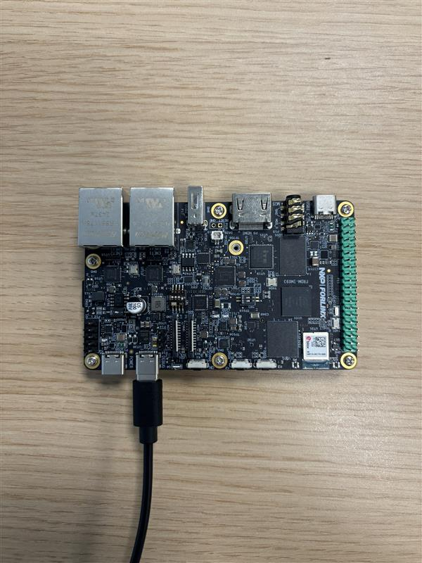
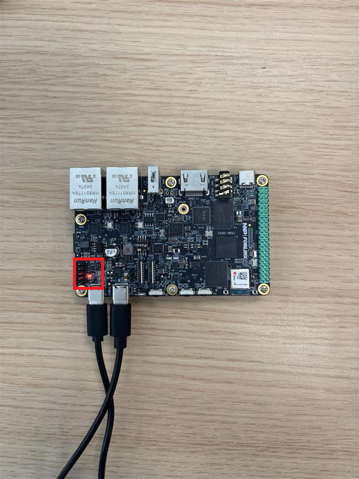
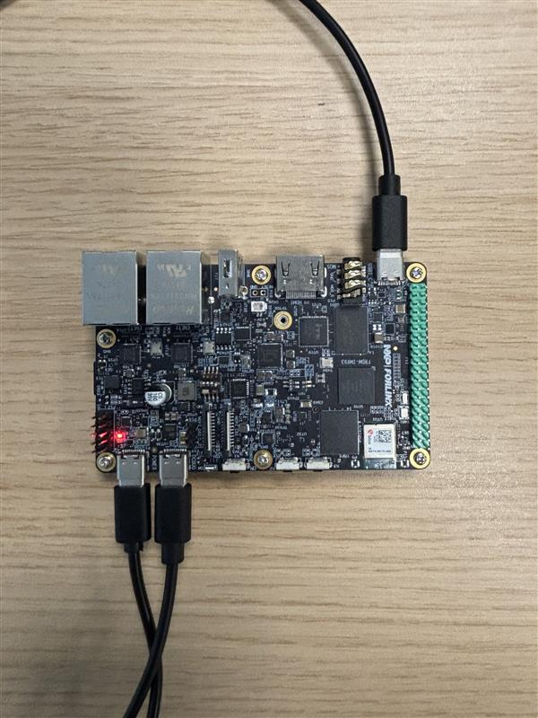
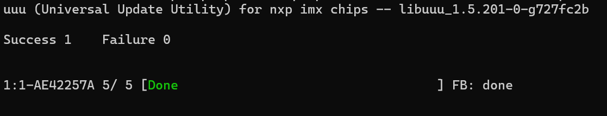
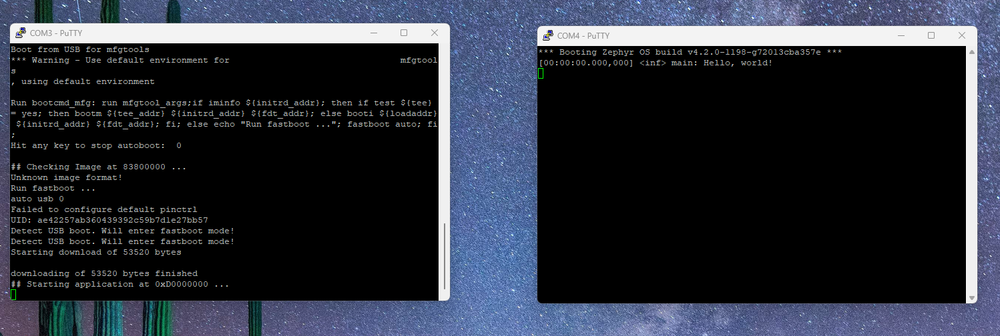
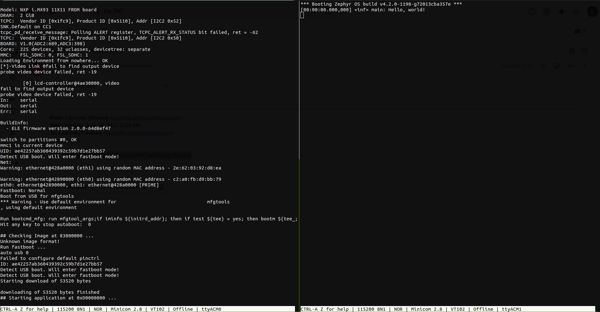
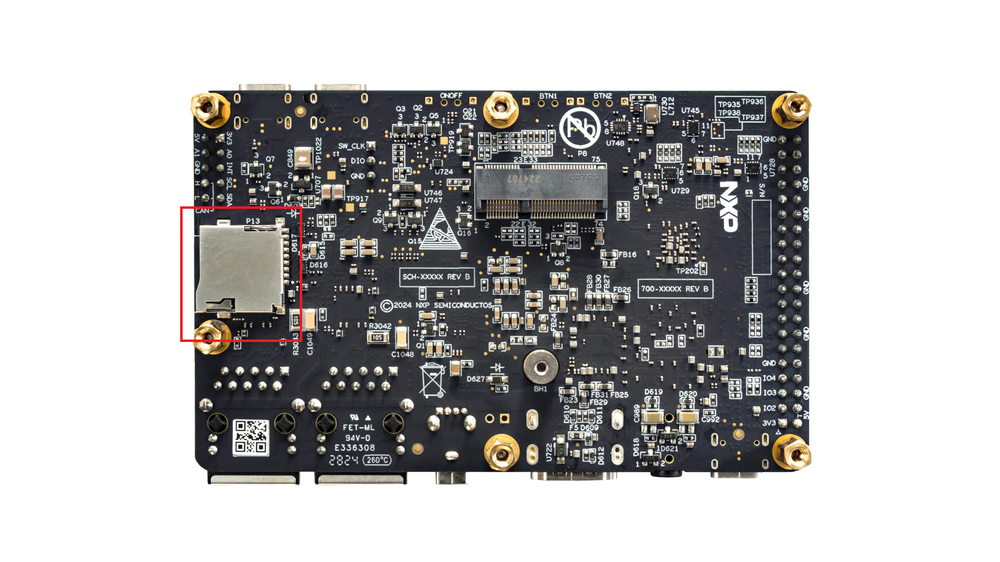
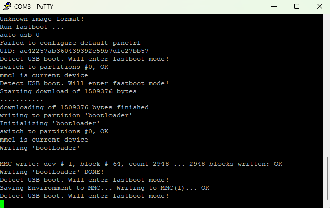
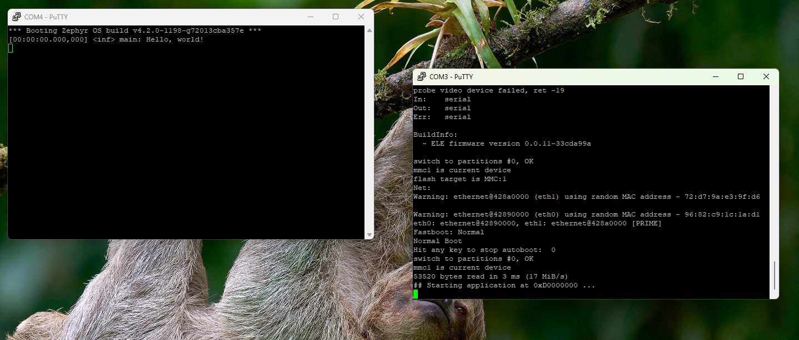

.. _booting-the-board:

Booting the board
=================

After building the application binary, the next step is to use it to boot
the board. The steps required by the boot procedure are described below.

This document shall use the ``hello_world`` sample as an example. The
detailed steps are, however, applicable to all samples or applications.

.. warning::

   The boot procedure should be performed on your native OS. Using a
   virtualized environment is highly discouraged because of the
   potential USB-related issues that might appear.

.. warning::

   If you're using Docker or WSL2, you're going to have to perform the
   steps presented below on your native OS.

Hardware setup
--------------

As described in :ref:`frdm-imx93-usb-c-ports`, the FRDM-IMX93 board has
three USB-C ports, which we'll be using to boot the board. Unless
otherwise stated, the steps described below are applicable to both Linux
and Windows users.

.. _connecting-the-debug-usb:

Connecting the DEBUG USB
~~~~~~~~~~~~~~~~~~~~~~~~

First, connect the **DEBUG USB** port to your computer as shown in
:numref:`debug-usb-connection`.

.. _debug-usb-connection:

   DEBUG USB connection

To check if your computer was able to detect the **DEBUG USB**, you'll have to:

.. tabs::

   .. group-tab:: Linux

      Run ``sudo dmesg``. Afterwards, look for the following logs
      (or something similar):

      .. image:: _static/figures/linux_tty_acm.png
         :align: center
         :scale: 40

      We are interested in the ``ttyACM0`` and ``ttyACM1`` serial devices.

   .. group-tab:: Windows

      1. Open up ``Device Manager``:

      .. image:: _static/figures/windows_device_mngr.png
         :align: center
         :scale: 40

      2. Look for and open up the ``Ports (COM & LPT)`` tab:

      .. image:: _static/figures/windows_com.png
         :align: center
         :scale: 40

      If the board was detected then you should see two new CH342 serial
      devices. Note that their names might differ (i.e. they might not be
      called ``COM3`` and ``COM4``)

Connecting the POWER USB
~~~~~~~~~~~~~~~~~~~~~~~~

If everything went well, you should now connect the **POWER USB** as shown
in :numref:`power-usb-connection`.

.. _power-usb-connection:

   POWER USB connection

The red LED highlighted in :numref:`power-usb-connection` indicates that
the board is now connected to a power source.

.. note::

   You may also connect the **POWER USB** to a USB-C phone charger.

Connecting the BOOT USB
~~~~~~~~~~~~~~~~~~~~~~~

Lastly, connect the **BOOT USB** as shown in :numref:`boot-usb-connection`.

.. _boot-usb-connection:

   BOOT USB connection

To check if your computer was able to detect the **BOOT USB**, you'll have to:

.. note::

   Your computer won't be able to detect the **BOOT USB** unless the
   board is powered on.

.. tabs::

   .. group-tab:: Linux

         Run ``sudo dmesg``. Afterwards, look for the following logs
         (or something similar):

         .. image:: _static/figures/linux_boot_usb.png
            :align: center
            :scale: 40

         Make sure that the manufacturer is ``NXP``. Additionally,
         ``idVendor`` (VID) and ``idProduct`` (PID) should be ``1FC9``
         and ``014E``, respectively.

   .. group-tab:: Windows
   
      1. Open up ``Device Manager``:

      .. image:: _static/figures/windows_device_mngr.png
         :align: center
         :scale: 40

      2. Look for and open up the ``Human Interface Devices`` tab:

      .. image:: _static/figures/windows_hid.png
         :align: center
         :scale: 40

      You should see that a new ``USB Input Device`` was added. To check
      if the new entry was added by the board:

      1. Open up the ``Properties`` tab by right-clicking on the device:

      .. image:: _static/figures/windows_hid_properties.png
         :align: center
         :scale: 40

      2. Go to the ``Details`` tab and select the ``Hardware Ids`` property:

      .. image:: _static/figures/windows_hid_vid_pid.png
         :align: center
         :scale: 40

      The device should have VID ``1FC9`` and PID ``014E``.

Serial console setup
--------------------

The interaction between your computer and the application running on the
FRDM-IMX93 board is performed via the **DEBUG USB** port. Therefore, if
you wish to see the logs printed by your application during development,
you'll need to open up a **serial console** on your computer. To do so,
you'll have to:

.. tabs::

   .. group-tab:: Linux

      1. Open a minicom console:

         .. code-block:: bash

            sudo minicom -D /dev/ttyACM0

      2. Open up the ``help`` menu by pressing ``CTRL-a Z``:

         .. image:: _static/figures/linux_minicom_help.png
            :align: center
            :scale: 40

      3. Open the ``cOnfigure Minicom`` menu by pressing ``O`` (capital):

         .. image:: _static/figures/linux_minicom_configure.png
            :align: center
            :scale: 40

      4. Open the ``Serial port setup`` menu by using the arrow and ``Enter`` keys:

         .. image:: _static/figures/linux_minicom_serial_port_setup.png
            :align: center
            :scale: 40

      5. Make sure ``Hardware Flow Control`` is set to ``No``:

         .. image:: _static/figures/linux_minicom_hfc.png
            :align: center
            :scale: 40

      6. Make sure ``Bps/Par/Bits`` is set to ``115200 8N1``:

         .. image:: _static/figures/linux_minicom_proto.png
            :align: center
            :scale: 40

      7. Close the ``Serial port setup`` by pressing ``Enter``.

      8. Navigate to ``Save setup as dfl`` and press ``Enter``.

      9. Navigate to ``Exit`` and press ``Enter``.

      You need to open a serial console for both of the serial devices
      exported by the board (``ttyACM0`` and ``ttyACM1``, respectively).
      Therefore, you should end up with two active ``minicom`` sessions.

      You only need to perform steps 2-9 once. To open the second ``minicom``
      console, just use the command described in step 1 (don't forget to
      change the name of the device if need be).

   .. group-tab:: Windows
   
      1. Open up ``PuTTY``:

      .. image:: _static/figures/windows_opening_putty.png
         :align: center
         :scale: 40

      2. Select the ``Serial`` connection type:

      .. image:: _static/figures/windows_putty_serial.png
         :align: center
         :scale: 40

      3. Set the speed to ``115200``:

      .. image:: _static/figures/windows_putty_serial_speed.png
         :align: center
         :scale: 40

      4. Type in the name of your serial device (line) and then click ``Open``:

      .. image:: _static/figures/windows_putty_serial_device.png
         :align: center
         :scale: 40

      You need to perform the steps described above for both of the
      serial devices exported by the board. Therefore, you should end
      up with two open serial consoles as shown in
      :numref:`windows-putty-consoles`.

      .. _windows-putty-consoles:

      .. figure:: _static/figures/windows_putty_consoles.png
         :alt: Windows PuTTY serial consoles
         :align: center
         :scale: 30

         Windows PuTTY serial consoles.

      As highlighted in :numref:`windows-putty-consoles`, the two serial
      devices exported by the board are called ``COM3`` and ``COM4`` but,
      in your case, this might differ.

      You can find the name of your serial device (line) by following
      the validation steps described in :ref:`connecting-the-debug-usb`.

Booting the board
-----------------

As described in :ref:`the-boot-switch`, the board supports booting
from multiple mediums. Consequently, before trying to boot the board,
you're going to have to select which medium to boot from. :numref:`boot-mediums`
shows all of the supported boot mediums and their associated boot switch
states.

.. warning::

   Before changing the state of the boot switch, you'll have to power off
   the board. To do so, you can just disconnect the **POWER USB**.

   You should **NOT** change the state of the boot switch while the board
   is powered on.

   To avoid damaging the board's **POWER USB** port, we encourage you to
   unplug it from your computer (instead of the board) or the power plug
   itself (if you're using a USB-C charger).

.. _usb-boot:

USB boot
~~~~~~~~

This mode requires you to have a physical connection with the board via
the **BOOT USB** port. Therefore, you'll most likely end up using this
mode for quick prototyping. To boot from USB, first power off the board
and then put it into USB mode by changing the state of the boot switch
to ``1000`` (see :numref:`boot-mediums`). Afterwards, power on the board
and then run:

.. tabs::

   .. group-tab:: Linux

      .. code-block:: bash

         ./boot/uuu -b ./boot/scripts/usb_boot ./boot/flash.bin ./build/zephyr/zephyr.bin

   .. group-tab:: Windows

      .. code-block:: powershell

         .\boot\uuu.exe -b .\boot\scripts\usb_boot .\boot\flash.bin .\build\zephyr\zephyr.bin

.. note::

   The name of the ``uuu`` binary might differ from the one used above.
   Therefore, make sure to adjust the command to suit your particular
   use case.

If the board was successfully booted, you should see something similar to
:numref:`usb-boot-success-sample` in the terminal pane you've used to run
``uuu``.

.. _usb-boot-success-sample:

   Boot success sample

:numref:`windows-boot-logs` shows the messages printed by the board during
the boot process, which are captured on a Windows machine.

.. _windows-boot-logs:

   Logs printed during the board boot process (Windows)

The ``COM3`` console shows the log printed by the bootloader, while the ``COM4``
console show the log printed by the ``hello_world`` sample application.

The Linux equivalent of :numref:`windows-boot-logs` is depicted in
:numref:`linux-boot-logs`.

.. _linux-boot-logs:

   Logs printed during the board boot process (Linux)

The logs printed by the bootloader (via ``ttyACM0``) as shown on the the
left side, while the logs printed by the application (via ``ttyACM1``) are
shown on the right side.

.. _sd-card-boot:

SD card boot
~~~~~~~~~~~~

As described in :ref:`usb-boot`, the USB boot method works really well
for quick prototyping/debugging since the application binary will change
frequently. However, once this phase ends and the application binary
is stable, you might need to store it somewhere on the board such that
you won't have to write it to the RAM each time the board is power
cycled (i.e. turned off and then on). This is where the SD card boot method
comes in handy.

To use this method, you'll need a microSD card such as the one found
`here <https://www.amazon.com/Kingston-16GB-microSDHC-microSD-SDCS/dp/B079H6PDCK>`__,
which also comes with a microSD to SD adapter. If your computer doesn't
have an SD card port, you'll also need to buy an USB SD card reader such
as the one found `here <https://uk.hama.com/00200132/hama-usb-card-reader-usb-2-0-sd-microsd-24-units-in-display>`__.

Once you have your SD card, you're going to have to prepare it before
actually using it. To do so [#]_:

.. tabs::

   .. group-tab:: Linux

      1. Insert the SD card in your computer.

      2. Run ``sudo dmesg`` and look for (logs may differ slightly):

         .. image:: _static/figures/linux_sd_card_dmesg.png
            :align: center
            :scale: 40

      3. Identify the name of the SD card device. It should be something
         like ``mmcblkx`` (``x`` is a number):

         .. image:: _static/figures/linux_sd_card_name.png
            :align: center
            :scale: 40

      4. Run ``fdisk``:

         .. code-block:: bash

            sudo fdisk /dev/mmcblk0 # replace with the name of your device

      5. Press the following sequence of keys inside ``fdisk``:

         .. code-block:: text

            p         [print currently existing partitions]
            d         [press until all partitions are deleted]
            n         [start the partition creation process]
            p         [set as primary partition]
            1         [set partition index to 1]
            1228800   [set first sector offset]
            <enter>   [press enter here]
            t         [opens the partition type menu]
            0b        [select W95 FAT32 format]
            p         [check if you have both of the partitions]
            w         [write partition table and exit]

         Your resulting partition table should look like this:

            .. image:: _static/figures/linux_fdisk_pt.png
               :align: center
               :scale: 40

      6. Format the partition as ``ext4``:

         .. code-block:: bash

            # replace with your device name to which you append "p1"
            sudo mkfs -t ext4 /dev/mmcblk0p1

      7. Mount the partition:

         .. code-block:: bash

            sudo mkdir -p /mnt/_tmp_nxp
            sudo mount /dev/mmcblk0p1 /mnt/_tmp_nxp

      8. Copy the application binary to the mounted partition:

         .. code-block:: bash

            sudo cp build/zephyr/zephyr.bin /mnt/_tmp_nxp

      9. Unmount the partition:

         .. code-block:: bash

            sudo umount /mnt/_tmp_nxp
            sudo rm -rf /mnt/_tmp_nxp

      10. Remove the SD card from your computer

   .. group-tab:: Windows

      1. Insert the SD card in your computer.

      2. Run ``diskpart`` and switch to the newly opened terminal:

         .. image:: _static/figures/windows_diskpart_main.png
            :align: center
            :scale: 40

         .. note::

           On some setups, running the ``diskpart`` command may require admin
           privilege. Therefore, if running ``diskpart`` results in an ``Access is denied``
           error message, try opening another PowerShell terminal with admin rights
           (see :ref:`changing-ps-execution-policy`) and then running the ``diskutil``
           command again.

      3. Run ``list disk`` and identify the disk number corresponding to your SD card:

         .. image:: _static/figures/windows_diskpart_list_disk.png
            :align: center
            :scale: 40

         In the image above, the identified disk number is ``2``.

         .. note::

            To identify the disk number you can look at the size of the disks
            and compare them with the size of your SD card. If this doesn't work,
            you can unplug the SD card, run the ``list disk`` command, plug in the
            SD card and run the command again. You can identify the disk number by
            checking which disk was added after the plug in operation.

         .. warning::

            Make sure you identify the disk number correctly as the subsequent
            operations will erase all of the partitions on the disk.

      4. Run ``select disk <disk_number>`` (replace ``disk_number`` with the number identified
         in the previous step):

         .. image:: _static/figures/windows_diskpart_select_disk.png
            :align: center
            :scale: 80

         .. note::

            If you run ``list disk`` after the select operation, you can see that
            an asterisk was added before the name of the selected disk. This can
            be observed in the figure above.

      5. Run ``clean`` to remove all of the partitions:

         .. image:: _static/figures/windows_diskpart_clean.png
            :align: center
            :scale: 80

      6. Run ``create partition primary offset=10240 size=4096``:

         .. image:: _static/figures/windows_diskpart_create_partition.png
            :align: center
            :scale: 80

         .. note::

            If your SD card has less than 4GB, make sure to adjust the value
            passed to the ``size`` argument. Generally, you can choose to omit
            it if the size of the SD card is <= ~32GB.

         .. warning::

            Make sure your new partition has index (partition number) 1!

      7. Run ``format fs=fat32 label="NXPCUP" quick``: 

         .. image:: _static/figures/windows_diskpart_format.png
            :align: center
            :scale: 80

         If everything went well, Windows will automatically mount your
         new partition. You can look for it by opening up ``This PC``:

            .. image:: _static/figures/windows_new_partition.png
               :align: center
               :scale: 60

      8. Close the ``diskutil`` terminal and go back to the ``PowerShell`` terminal.

      9. Copy your application binary to the new partition:

         .. code-block:: powershell

            # note: the drive letter may differ for you
            cp .\build\zephyr\zephyr.bin E:\

         .. note::

            Alternatively, if you use the GUI, you can just drag and drop
            the application binary to the partition.

      10. Remove the SD card from your computer.

After preparing the SD card, you can insert it into the SD card slot found
on the bottom of the board. This is highlighted in :numref:`frdm-imx93-sd-card`.

.. _frdm-imx93-sd-card:

   FRDM-IMX93 SD card slot

Before being able to boot the application binary, the bootloader needs to
be configured so that it will automatically load the application from the
previously created partition. To do so, put the board in USB mode by changing
the state of the boot switch to ``1000`` (see :numref:`boot-mediums`). After
doing so, power on the board by connecting the **POWER USB** port and then
run [#]_:

.. tabs::

      .. group-tab:: Linux

         .. code-block:: bash

            ./boot/uuu -b ./boot/scripts/sd_boot ./boot/flash.bin

      .. group-tab:: Windows

         .. code-block:: powershell

            .\boot\uuu.exe -b .\boot\scripts\sd_boot .\boot\flash.bin

If everything went well, you should see some output similar to that shown
in :numref:`sd-boot-script`.

.. _sd-boot-script:

   Sample output after running the ``sd_boot`` script.

The setup is now complete. Power off the board and then put it into SD
card mode by changing the state of the boot switch to ``1100``
(see :numref:`boot-mediums`). Now, when you power on the board again,
it should automatically start your application. As shown in :numref:`sd-boot`,
``COM3``/``ttyACM0`` will contain the bootloader logs, while ``COM4``/``ttyACM1``
will contain the logs of your application.

.. _sd-boot:

   Booting the ``hello_world`` sample from the SD card.

To change the application binary:

1. Power off the board.

2. Remove the SD card from the board.

3. Insert the SD card into your computer.

4. Copy the new binary to the SD card as done during the SD card preparation.

5. Remove the SD card from your computer.

6. Insert the SD card into the board.

7. Power on the board.

.. note::

   There's no need to change the state of the boot switch while changing
   the application binary. Therefore, the boot switch should remain in
   the SD card mode while preforming all of the steps above.

.. _emmc-boot:

eMMC boot
~~~~~~~~~

If buying an SD card or an USB SD card reader isn't an option, you can make
use of the 32GB eMMC integrated on the board. However, this will come with
the cost of a slight increase in the complexity of the setup steps.

To boot from eMMC, you'll first have to export the eMMC as an USB massive
storage device. You can think of this step as the equivalent of inserting
an SD card into your computer. To do so, first power off the board and put
it into USB mode by setting the state of the boot switch to ``1000``
(see :numref:`boot-mediums`). Afterwards, power on the board and then:

.. tabs::

      .. group-tab:: Linux

         1. Run:

            .. code-block:: bash

               ./boot/uuu -b spl ./boot/flash.bin

            You should now see some output from the bootloader
            in the ``ttyACM0`` serial console.

         2. Press ``CTRL-C`` inside the ``ttyACM0`` console. You should
            now see the ``u-boot`` prompt as shown below:

            .. image:: _static/figures/uboot_prompt.png
               :align: center

         3. Inside the serial console, run:

            .. code-block:: bash

               ums mmc 0

      .. group-tab:: Windows

         1. Run:

            .. code-block:: powershell

               .\boot\uuu.exe -b spl .\boot\flash.bin

            You should now see some output from the bootloader
            in the ``COM3`` serial console.

         2. Press ``CTRL-C`` inside the ``COM3`` console. You should now
            see the ``u-boot`` prompt as shown below:

            .. image:: _static/figures/uboot_prompt.png
               :align: center

         3. Inside the serial console, run:

            .. code-block:: bash

               ums mmc 0

After exporting the eMMC device, you'll have to prepare it. To do so,
please follow the SD card preparation steps described in :ref:`sd-card-boot`.
Make sure you also copy the application binary to the eMMC device.

Once you're done, go back to the serial console and type ``CTRL-C``. You'll
no longer see the eMMC device mounted in your filesystem. Finally, power off
and on the board without changing the state of the boot switch (i.e. board
should be in USB mode) and then run:

.. tabs::

      .. group-tab:: Linux

         .. code-block:: bash

            ./boot/uuu -b ./boot/scripts/emmc_boot ./boot/flash.bin

      .. group-tab:: Windows

         .. code-block:: powershell

            .\boot\uuu.exe -b .\boot\scripts\emmc_boot .\boot\flash.bin

The setup is now complete. Power off the board and then put it into eMMC
mode by changing the state of the boot switch to ``0100`` (see :numref:`boot-mediums`).
Now, when you power on the board again, it should automatically start your
application. As shown in :numref:`sd-boot`, ``COM3``/``ttyACM0`` will contain
the bootloader logs, while ``COM4``/``ttyACM`` will contain the logs of your
application.

To change the application binary:

1. Power off the board.

2. Switch the board to USB mode.

3. Power on the board.

4. Export the eMMC device as an USB massive storage device as shown in
   :ref:`emmc-boot`.

5. Copy the new binary to the eMMC device as done during the preparation step.

6. Power off the board.

7. Switch the board to eMMC mode.

8. Power on the board.

.. [#] Unless you change your SD card, you should only follow these steps once.
.. [#] Unless you change your SD card, you should only run this command once.
