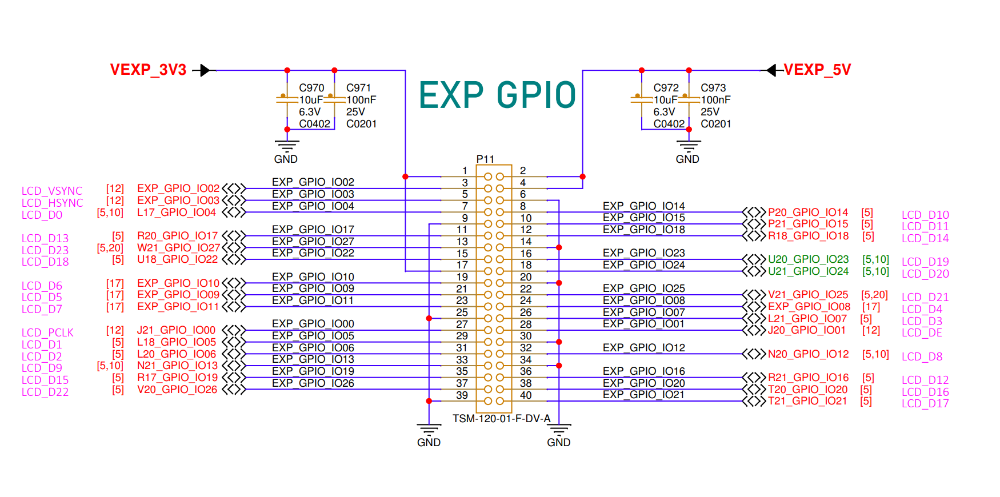
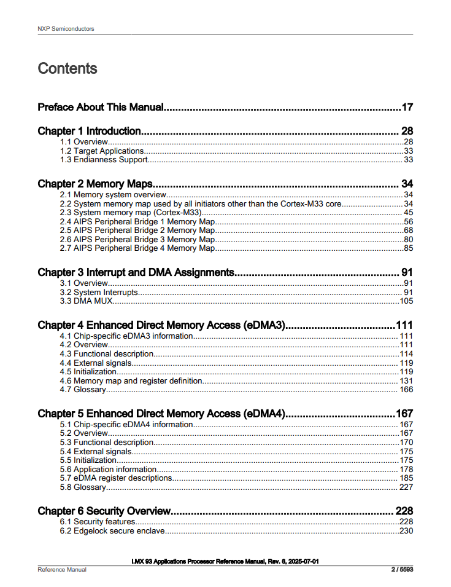

.. _the-development-board:

The development board
=====================

The **FRDM-IMX93** is a small and compact board provided by NXP, which
is based on the `i.MX93`_ chip and, thus, offers the following hardware
features [#]_:

* 2 x ARM Cortex-A55 cores
* 1 x ARM Cortex-M33 core
* 3 x USB-C ports
* 32GB eMMC
* 2GB of RAM
* 40-pin expansion header

The top view of the board is shown in :numref:`frdm-imx93-top-view`.

.. _frdm-imx93-top-view:

   Top view of the FRDM-IMX93 board [#]_.

.. _frdm-imx93-usb-c-ports:

The USB-C ports
---------------

As previously mentioned, the FRDM board comes with **three** USB Type-C ports,
which are highlighted in :numref:`frdm-imx93-usb`.

.. _frdm-imx93-usb:

   FRDM-IMX93 USB Type-C ports

Each of these ports serves a different purpose, as briefly described below:

1. **BOOT USB** (highlighted in cyan): used to boot the board.
2. **DEBUG USB** (highlighted in green): used for debugging the board and
   communicating with the bootloader.
3. **POWER USB** (highlighted in pink): used to power the board.

During development, you'll most likely find yourself utilizing all three of them.

.. _the-boot-switch:

The boot switch
---------------

Before booting the board, you'll need to tell the boot ROM where to get
the bootloader from. To do so, you'll have to mechanically change the
state of a series of switches, colectively referred to as the **boot switch**.
Its location is highlighted in :numref:`frdm-imx93-boot-switch` using green.

.. _frdm-imx93-boot-switch:

   FRDM-IMX93 boot switch

As you can see, the boot switch is made up of **four** switches, numbered
from 1 to 4, each of them having two possible states: ON or OFF. The boot
medium is selected by placing these switches in the appropriate states.

As a convention, we'll be referring to the state of the boot switch as
a combination of four digits with the following format: **abcd**, where
**a** is the state of switch 1, **b** is the state of switch 2 and so on.
Each of the letters that make up the state of the boot switch has two
possible values: 0 and 1, signifying that the switch is either OFF or ON.
Some examples are presented below:

* **0000**: all switches are OFF
* **1111**: all switches are ON
* **1000**: switch 1 is ON, switches 2-4 are OFF
* **1100**: switches 1-2 are ON, switches 3-4 are OFF
* **1001**: switch 1 and 4 are ON, switches 2-3 are OFF

With this in mind, :numref:`boot-mediums` provides a list of the supported
boot mediums and their associated boot switch states.

.. _boot-mediums:

.. list-table:: List of supported boot mediums
   :header-rows: 1
   :widths: 30 30
   :align: center

   * - Boot switch state
     - Boot medium

   * - 1000
     - USB

   * - 1100
     - SD

   * - 0100
     - eMMC

The expansion header
--------------------

To allow communicating with external modules (e.g. I2C, SPI, etc.), the FRDM-IMX93
board is equipped with a pin header made up of 40 pins. This is referred to as
the **expansion header** and is highlighted in :numref:`frdm-imx93-exp-gpio`.

.. _frdm-imx93-exp-gpio:

   FRDM-IMX93 expansion header.

When assembling the car, you'll be using this header to connect all of your
components to the board.

.. _frdm-imx93-board-schematic:

The board schematic
-------------------

Looking at just pictures of the board might not provide enough information to,
for example, be able to properly connect an external component. Consequently,
this is where the **board schematic** comes in handy. Among other things, the
board schematic shows how the board components are connected together and which
signals are routed through the board's pin headers.

In this regard, NXP provides the schematic for the FRDM-IMX93 board, which can
be downloaded from `here <https://www.nxp.com/webapp/Download?colCode=FRDM-iMX93-DESIGN-FILES>`__ [#]_.
Upon inspection, the downloaded archive contains three directories:

.. code-block:: text

   .
   ├── Design Files
   ├── Gerbers
   └── PDF

You may find the board schematic under ``PDF/SPF-94611_B1``. An excerpt from the
schematic showcasing the expansion header (taken from page 20) is presented in
:numref:`frdm-imx93-schematic-excerpt`.

.. _frdm-imx93-schematic-excerpt:

   FRDM-IMX93 schematic excerpt showcasing the expansion header.

Upon taking closer look, we can extract the following information regarding
the expansion header:

* the part number/ID for the pin header is **TSM-120-01-F-DV-A**. Usually, you can
  use this identifier to search more information on the Internet regarding the
  component (for instance, the datasheet).

* the unique identifier for the component is **P11**. This ID is usually used
  to distinguish between the different components of the board and is usually
  unique. You can also use this ID to find the component on the physical board
  (note that the ID is usually small and, since there's a lot of components,
  the task of identifying where the ID is written on the PCB might not be
  trivial).

* the name of the signals routed through this component. This is the most
  important piece of information because it will tell you how to connect your
  external component.

All of this information is also highlighted in :numref:`frdm-imx93-schematic-highlights`.

.. _frdm-imx93-schematic-highlights:

   
   Highlighted information from EXP GPIO.

We can also see that the pins are numbered from 1 to 40. To find the pin numbers
on the physical board, you'll have to look at the labels inscribed on its back.
The bottom view of the board is shown in :numref:`frdm-imx93-bottom-view`. The
section of interest is highlighted in red.

.. _frdm-imx93-bottom-view:

.. figure:: _static/figures/frdm_imx93_bottom_view.png
   :alt: FRDM-IMX93 board (bottom view)
   :align: center

   Bottom view of the FRDM-IMX93 board [#]_.

Per the schematic shown in :numref:`frdm-imx93-schematic-excerpt`, pin number 1 is
tied to 3.3V. Consequently, the pin inscribed with the `3V3` symbol on the back of
the board corresponds to pin 1. This is highlighted in :numref:`frdm-imx93-pin-1`.
Once pin 1 has been determined, we can also determine the position of the rest of
the pins by looking at their positions relative to pin 1 on the pin header.

.. _frdm-imx93-pin-1:

   Finding pin 1 on the expansion header

.. note::

  You can use any of the labels inscribed on the bottom of the board
  to find your reference pin.

The reference manual
--------------------

Another piece of documentation you might find yourself needing while working
with the FRDM-IMX93 is the SoC's reference manual, which can be found
`here <https://www.nxp.com/webapp/Download?colCode=IMX93RM>`__ [#]_. This
provides information on the memory map and various IPs that make up the SoC.
The information is neatly organized in chapters, each of which providing
details on a certain IP or topic. :numref:`imx93-trm-excerpt` provides an
excerpt taken from the reference manual.

.. _imx93-trm-excerpt:

   Excerpt taken from the i.MX93 reference manual

Additional resources
--------------------

Generally, you'll find all of the official board and SoC documentation
on the `FRDM-IMX93`_ and `i.MX93`_ home pages in the `Documentaton` section.

Glossary
--------

* **bootloader**: piece of software that handles the hardware initialization and
  can be used to load other images (e.g: our application)

* **boot CPU**: CPU that handles the boot process

* **boot ROM**: first piece of software executed by the boot CPU when the board
  is first powered on.

* **PCB**: stands for Printed Circuit Board and is used to refer to the FRDM
  board.

* **IP**: stands for Intellectual Property and is used to refer to the hardware
  modules that make up the chip.

.. [#] List is not exhaustive.
       For a more comprehensive list of features please check out:
       https://www.nxp.com/design/design-center/development-boards-and-designs/frdm-i-mx-93-development-board:FRDM-IMX93

.. [#] Source: https://www.nxp.com/design/design-center/development-boards-and-designs/frdm-i-mx-93-development-board:FRDM-IMX93

.. [#] You may have to sign in first.

.. [#] Source: https://www.nxp.com/design/design-center/development-boards-and-designs/frdm-i-mx-93-development-board:FRDM-IMX93

.. [#] You may have to sign in first.

.. _i.MX93: https://www.nxp.com/products/processors-and-microcontrollers/arm-processors/i-mx-applications-processors/i-mx-9-processors/i-mx-93-applications-processor-family-arm-cortex-a55-ml-acceleration-power-efficient-mpu:i.MX93

.. _FRDM-IMX93: https://www.nxp.com/design/design-center/development-boards-and-designs/frdm-i-mx-93-development-board:FRDM-IMX93
