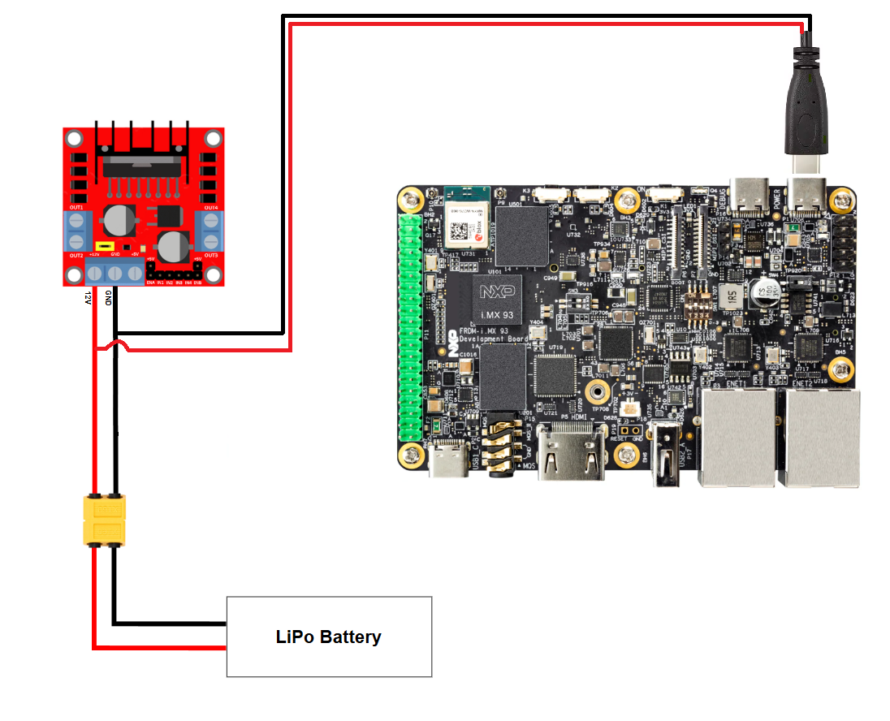

.. _connecting-the-battery:

Connecting the battery
======================

General info
------------

Battery connection could be considered the final step before powering
up the hardware. It may look as trivial as connecting a phone to the
power charger, however it needs way more attention. You may wonder why
is that? One reason is that the battery is a 7.4V LiPO type and doesn't have
any protection circuit or BMS (Battery Management System) circuit.

.. warning::

   Do not short the battery terminals! A short at the battery terminals will
   lead to massive current discharge and will heat up the battery instantaneously,
   resulting in the battery catching fire or exploding.

.. warning::

   Make sure the polarity is correct before powering up. Wrong polarity will
   damage the hardware. As you may already know, the battery is a source of
   continuous electrical current which has two poles: positive (+, anode) and
   negative (-, cathode).

Now that we passed over the scary warning, let's play with the wires :).

Powering up
-----------

.. important::

   Do all the wire connections without the battery first

Connect the positive end of the battery connector to the ``12V`` pin of the
L298N H-BRIDGE module and the negative end to the ``GND`` pin as shown in
:numref:`l298-battery-con-diagram`.

Afterwards, connect the USB cable terminals to the strip connector. The
positive red wire should be connected to the ``12V`` pin, while the negative
black wire should go to the ``GND`` pin.

Finally, you can connect the battery via the yellow XT600 connector.

.. note::
   The USB Type C wires could be soldered or directly connected to the
   strip connector of the H-BRIDGE (without any soldering).

.. _l298-battery-con-diagram:

   Battery connection diagram

