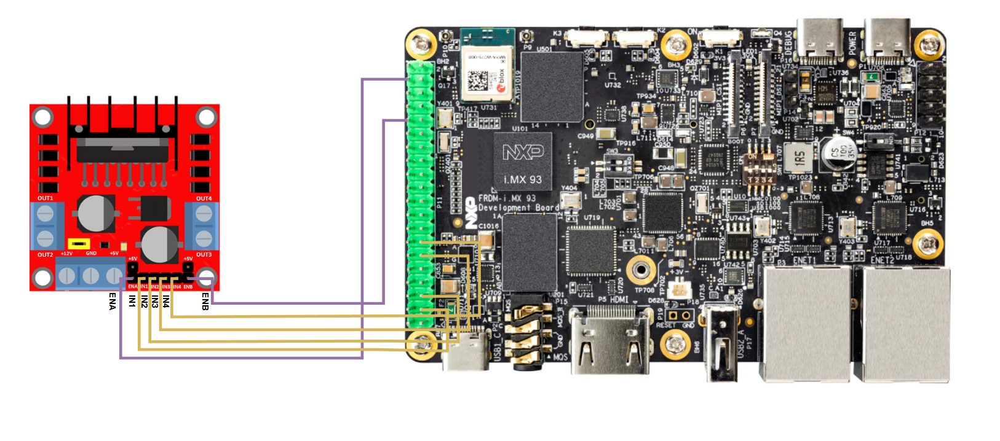
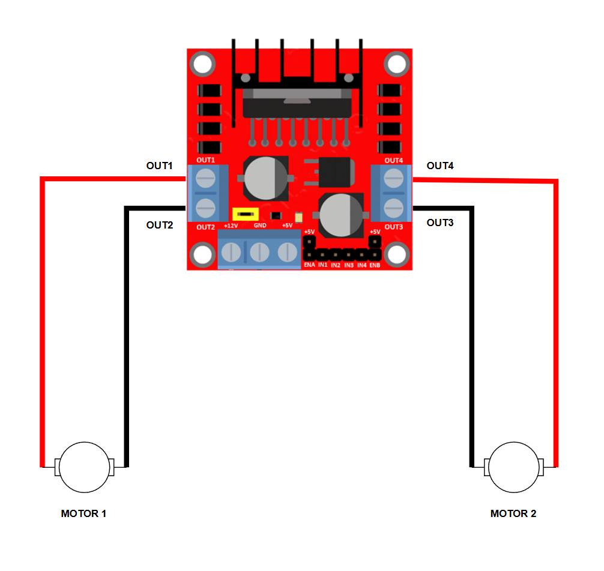

.. _l298n-hw:

The L298N H-BRIDGE
==================

Hardware setup
--------------

To simplify the block diagrams, the hardware setup has been split into three
major steps, which are detailed below.

Connecting the data pins
~~~~~~~~~~~~~~~~~~~~~~~~

The `L298N`_ H-BRIDGE module allows users to independently control the speed
and direction of two motors at once. In this regard, each motor has three
possible directions:

1. ``Forward``: the motor is spinning forward.
2. ``Backwards``: the motor is spinning backwards.
3. ``Fast stop``/``Brake``: the motor is not spinning.

For a given motor, the direction is selected based on the logic level applied
to its corresponding ``IN`` pins:

1. ``IN1`` and ``IN2`` for motor 1.
2. ``IN3`` and ``IN4`` for motor 2.

The relationship between a motor's direction and the state of its corresponding
``IN`` pins is summarized in :numref:`motor-direction`.

.. _motor-direction:

.. list-table:: Motor direction based on state of IN pins
   :header-rows: 1
   :widths: 30 30 30
   :align: center

   * - Direction
     - IN1/IN3 state
     - IN2/IN4 state

   * - Fast stop
     - LOW
     - LOW

   * - Fast stop
     - HIGH
     - HIGH

   * - Forward
     - HIGH
     - LOW

   * - Backwards
     - LOW
     - HIGH

To better understand the relationship between the two, some examples
are presented below:

1. ``IN1`` is LOW, ``IN2`` is LOW => motor 1 is stopped
2. ``IN1`` is HIGH, ``IN2`` is LOW => motor 1 is spinning forward
3. ``IN3`` is HIGH, ``IN4`` is LOW => motor 2 is spinning forward
4. ``IN3`` is LOW, ``IN4`` is HIGH => motor 2 is spinning backwards

.. note::

   The two motors are completely independent. For example, motor 1
   could be spinning forward (via setting ``IN1`` and ``IN2``), while
   motor 2 could be stopped or even spinning bacwards (via setting
   ``IN3`` and ``IN4``).

The module also allows users to configure the speed of the motors by routing
two PWM signals through the ``ENA`` (for motor 1) and ``ENB`` (for motor 2)
pins. A 0% duty cycle PWM would result in no speed (i.e. motor is stopped),
while a 100% duty cycle PWM would result in the maximum speed.

Based on :numref:`frdm-imx93-exp-gpio`, we can use the following 6 pins
on the FRDM-IMX93 ``EXP GPIO`` header:

1. Pin 3 (``EXP_GPIO_IO02``) for the IN1 GPIO.
2. Pin 5 (``EXP_GPIO_IO03``) for the IN2 GPIO.
3. Pin 11 (``EXP_GPIO_IO17``) for the IN3 GPIO.
4. Pin 13 (``EXP_GPIO_IO27``) for the IN4 GPIO.
5. Pin 38 (``EXP_GPIO_IO20``) for the ENA PWM.
6. Pin 32 (``EXP_GPIO_IO12``) for the ENB PWM.

Therefore, you should connect the pins on the two boards as indicated below:

1. L298N IN1 pin to FRDM-IMX93 pin 3.
2. L298N IN2 pin to FRDM-IMX93 pin 5.
3. L298N IN3 pin to FRDM-IMX93 pin 11.
4. L298N IN4 pin to FRDM-IMX93 pin 13.
5. L298N ENA pin to FRDM-IMX93 pin 38.
6. L298N ENB pin to FRDM-IMX93 pin 32.

:numref:`l298n-data-con-diagram` highlights the aforementioned connections
between the two boards.

.. _l298n-data-con-diagram:

   L298N data pins connection diagram [#]_

Connecting the motors
~~~~~~~~~~~~~~~~~~~~~

The next step is to connect the two motors. The L298N module controls
the attached motors via two pairs of pins:

1. ``OUT1`` and ``OUT2`` for motor 1.
2. ``OUT3`` and ``OUT4`` for motor 2.

:numref:`l298-motor-con-diagram` shows a potential way of connecting
the two motors.

.. _l298-motor-con-diagram:

   L298N motor connection diagram

Please be weary of how you choose to connect the motors as this will
impact the meaning of the ``Forward`` and ``Backwards`` directions.
For example, in the scenario shown in :numref:`l298-motor-con-diagram`,
applying the following states to the ``IN`` pins:

1. ``IN1`` HIGH, ``IN2`` LOW
2. ``IN3`` HIGH, ``IN4`` LOW

would result in motor 1 spinning forward and motor 2 spinning backwards.
This is because the connections to the ``OUT`` pins for motor 2 were
inverted (comparted to motor 1 connections).

Despite this, the connection is valid and can be easily be handled in
software (see the :ref:`hbridge-sample` sample, which can handle this
particular scenario).

Connecting the battery
~~~~~~~~~~~~~~~~~~~~~~

The H-BRIDGE module and the development board need to be connected to
the same battery. See :ref:`connecting-the-battery` for more details.

Testing the connection
----------------------

You can use the :ref:`hbridge-sample` sample to check if the module was
properly connected to the development board. Instructions on how to build
and run the sample are provided in the :ref:`hbridge-sample-how-to-build`
and the :ref:`hbridge-sample-how-to-run` sections.

.. _L298N: https://www.st.com/resource/en/datasheet/l298.pdf

.. [#] The diagram for the L298N module was taken from https://www.homemade-circuits.com/l298n-dc-motor-driver-module-explained/
