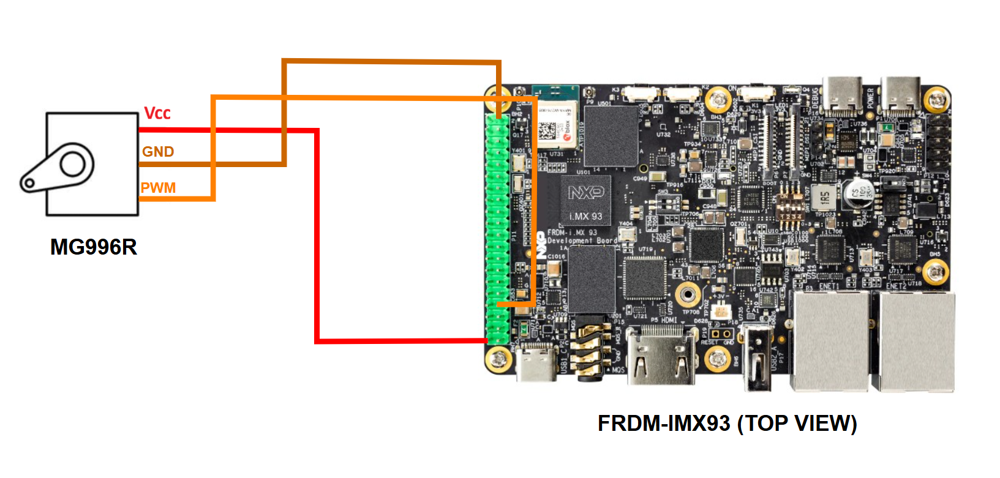

.. _mg996r-hw:

The MG996R servo motor
======================

Hardware setup
--------------

Before proceeding with the hardware setup, make sure that the FRDM-IMX93
board is powered off.

As per the MG996R `datasheet`_, the servo motor has 3 signals that need
to be connected:

1. The ground signal, which is known as ``GND``.
2. The power signal, which is known as ``Vcc``.
3. The PWM signal, which is known as ``PWM``.

Each of these signals uses a different color:

1. Brown for ``GND``.
2. Red for ``Vcc``.
3. Orange for ``PWM``.

Based on :numref:`frdm-imx93-exp-gpio`, we can use the following 3 pins
on the FRDM-IMX93 ``EXP GPIO`` header:

1. Pin 39 (``GND``) for the ground.
2. Pin 2 (``VEXP_5V``) for the power.
3. Pin 7 (``EXP_GPIO_IO04``) for the PWM.

Therefore, you should connect the pins on the two boards as indicated below:

1. MG996R GND pin to FRDM-IMX93 pin 39.
2. MG996R Vcc pin to FRDM-IMX93 pin 2.
3. MG996R PWM pin to FRDM-IMX93 pin 7.

:numref:`mg996r-con-diagram` highlights the aforementioned connections
between the FRDM-IMX93 board and the motor.

.. _mg996r-con-diagram:

   MG996R connection diagram [#]_.

Additionally, the MG996R `datasheet`_ specifies the value of the PWM period,
which should be set to 20 ms. The rotation angle is set by adjusting the
duty cycle of the PWM signal, as described below:

1. 1ms duty cycle corresponds to 0 degrees (leftmost position).
2. 1.5ms duty cycle corresponds to 90 degrees (center position).
3. 2ms duty cycle corresponds to 180 degrees (rightmost position).

.. note::

   The range of the rotation angle detailed in the `datasheet`_ was
   shifted from [-90, 90] to [0, 180] here.

Testing the connection
----------------------

You can use the :ref:`servo-sample` sample to check if the servo motor was
properly connected to the development board. Instructions on how to build
and run the sample are provided in the :ref:`servo-sample-how-to-build`
and the :ref:`servo-sample-how-to-run` sections.

Further reading
---------------

You may find further information on the servo motor in the `datasheet`_.

.. _datasheet: https://www.handsontec.com/dataspecs/motor_fan/MG996R.pdf
.. [#] The diagram for the MG996R servo motor was taken from the `datasheet`_.
