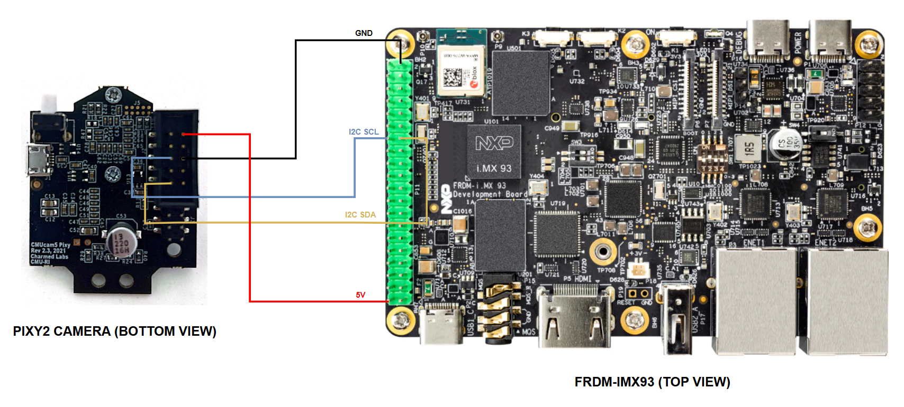

.. _pixy2-camera-hw:

The Pixy2 camera
================

.. _pixy2-software-setup:

Software setup
--------------

As per `this <https://docs.pixycam.com/wiki/doku.php?id=wiki:v2:porting_guide>`__ document,
the Pixy2 camera supports communicating with the development board using interfaces such as
SPI, I2C, UART, etc...Although this guide will only cover the communication over SPI and I2C,
you are, of course, free to choose whatever interface best suits the needs of your application.

Before preparing the hardware setup, the Pixy2 camera will first have to be configured to work
with the selected communication interface. To do so, we're going to be using a tool called
``PixyMon``, which you can download from `here <https://docs.pixycam.com/wiki/doku.php?id=wiki:v2:pixy_regular_quick_start>`__
(see the **Install PixyMon** section).

If everything went well, you should now be able to open up PixyMon. Initially, you'll be
greeted with an empty window such as the one shown in :numref:`pixymon-no-camera`.

.. _pixymon-no-camera:

   Opening PixyMon for the first time

Notice the **No Pixy devices have been detected** message on the bottom of the
window? This means that the Pixy2 camera is currently not connected to our computer.
Therefore, the next step is to connect the Pixy2 camera to the host computer
using USB. The USB port is located on the bottom of the Pixy2 board, as highlighted
in :numref:`pixy2-usb-port`.

.. _pixy2-usb-port:

   Pixy2 USB port

After connecting the camera, if you look at the PixyMon window, you'll
notice that the menu icons are no longer greyed out. This is highlighted
in :numref:`pixymon-menu`.

.. _pixymon-menu:

   PixyMon menu

To configure the communication interface, go to ``Settings > Interface`` as
shown in :numref:`pixymon-itf-settings`.

.. _pixymon-itf-settings:

   PixyMon interface settings

You can select the desired communication interface using the ``Data out port``
setting as described below:

1. For SPI, select ``SPI with SS``.
2. For I2C, select ``I2C``.

If you wish to use ``I2C``, you'll also have to configure the I2C address
of the Pixy2 camera. You can do so by specifying the desired value in the
``I2C address`` setting. The :ref:`pixy2-sample` sample assumes that the
I2C address is set to ``0x54`` so, to avoid modifying the sample, we
encourage you to use the same address.

.. note::

   You are free to utilize whatever I2C address you see fit, but please
   make sure to update the :ref:`pixy2-sample` sample.

Once you're done, click ``Apply`` and then ``OK``. You may now disconnect
the camera from your host computer.

Hardware setup
--------------

To connect the FRDM-IMX93 board and the Pixy2 camera, you'll have to first make
sure that both of them are powered off. This step is, of course, a prerequisite
regardless of the chosen communication interface. After doing so, you'll then
have to locate the connection headers on the two devices. For the FRDM-IMX93
board, we'll be using the ``EXP GPIO`` expansion header, which is shown in
:numref:`frdm-imx93-exp-gpio`. Be sure to also go through the :ref:`frdm-imx93-board-schematic`
section, which will teach you how to identify the pin numbers on the ``EXP GPIO``
header.

:numref:`pixy2-con-hdr` highlights the Pixy2 connection header (denoted as
``CON HDR`` in this document), which can be found on the bottom of the board.
If you opt to use the `Pixy2 schematic`_ file, you may notice that the
``CON HDR`` is assigned the ``J2`` unique identifier.

.. _pixy2-con-hdr:

   PIXY2 connection header (denoted as CON HDR).

:numref:`pixy2-con-hdr-pins` shows how each pin on ``CON HDR`` is numbered
and which signals are routed through these pins:

.. _pixy2-con-hdr-pins:

   PIXY2 connection header pin numbering [#]_.

The pin number is shown between the parentheses (e.g. ``(5) I2C SCL`` refers
to pin number 5), while the name of the routed signal is shown right after/before
the pin number (e.g. ``(6) GND`` refers to the ground signal).

Based on the names assigned to each of the pins in :numref:`pixy2-con-hdr-pins`,
we can deduce that:

1. The ``SPI MISO``/``UART RX`` signal needs to be connected to pin 1.
2. The ``SPI SCK`` signal needs to be connected to pin 3.
3. The ``GND`` signal needs to be connected to pin 6.

and so on and so forth.

I2C communication
~~~~~~~~~~~~~~~~~

.. warning::

   Before getting started, don't forget to configure the Pixy2 camera
   for I2C communication as documented in :ref:`pixy2-software-setup`!

The chief advantage of this interface is that it only utilizes two lines for
communication: the **clock** line (SCK/SCL) and the **data** line (SDA). This is
particularly useful in applications where the number of available pins is limited.

To set up the communication over I2C, we'll be utilizing a total of 2 signals:

1. I2C clock signal, which is known as ``I2C SCL``.
2. I2C data signal, which is known as ``I2C SDA``.

Based on :numref:`pixy2-con-hdr-pins`, we can use the following 4 pins on the
Pixy2 ``CON HDR`` header:

1. Pin 5 (``I2C SCL (5)``) for the I2C clock.
2. Pin 9 (``I2C SDA (9)``) for the I2C data.
3. Pin 6 (``(6) GND``) for the ground.
4. Pin 2 (``(2) 5V``) for the power.

Based on :numref:`frdm-imx93-exp-gpio`, we can use the following 4 pins on
the FRDM-IMX93 ``EXP GPIO`` header:

1. Pin 28 (``EXP_GPIO_IO01``) for the I2C clock.
2. Pin 27 (``EXP_GPIO_IO00``) for the I2C data.
3. Pin 39 (``GND``) for the ground.
4. Pin 2 (``VEXP_5V``) for the power.

Therefore, you should connect the pins on the two boards as indicated below:

1. Pixy2 pin 5 to FRDM-IMX93 pin 28.
2. Pixy2 pin 9 to FRDM-IMX93 pin 27.
3. Pixy2 pin 6 to FRDM-IMX93 pin 39.
4. Pixy2 pin 2 to FRDM-IMX93 pin 2.

:numref:`pixy2-i2c-con-diagram` highlights the aforementioned connections
between the two boards. Alternatively, :numref:`pixy2-i2c-con-schematic`
provides a schematic with the connections required for the I2C communication.

.. _pixy2-i2c-con-diagram:

   Pixy2 I2C connection diagram.

.. _pixy2-i2c-con-schematic:

   Pixy2 I2C connection schematic.

SPI communication
~~~~~~~~~~~~~~~~~

.. warning::

   Before getting started, don't forget to configure the Pixy2 camera
   for SPI communication as documented in :ref:`pixy2-software-setup`!

Alternatively, the Pixy2 camera is able to communicate with the development
board via SPI, which, in this particular case, will be utilizing a total of
4 signals:

1. SPI clock signal, which is known as ``SPI SCK``.
2. SPI master output data, which is known as ``SPI MOSI`` [#]_.
3. SPI slave output data, which is known as ``SPI MISO`` [#]_.
4. SPI slave select signal, which is known as ``SPI SS`` [#]_.

Based on :numref:`pixy2-con-hdr-pins`, we can use the following 6 pins on the
Pixy2 ``CON HDR`` header:

1. Pin 3 (``SPI SCK (3)``) for the SPI clock.
2. Pin 4 (``(4) SPI MOSI, UART TX``) for the SPI master output data.
3. Pin 1 (``SPI MISO, UART RX (1)``) for the SPI slave output data.
4. Pin 7 (``SPI SS (7)``) for the SPI slave select.
5. Pin 6 (``(6) GND``) for the ground.
6. Pin 2 (``(2) 5V``) for the power.

Based on :numref:`frdm-imx93-exp-gpio`, we can use the following 6 pins on
the FRDM-IMX93 ``EXP GPIO`` header:

1. Pin 23 (``EXP_GPIO_IO11``) for the SPI clock.
2. Pin 19 (``EXP_GPIO_IO10``) for the SPI master output data.
3. Pin 21 (``EXP_GPIO_IO09``) for the SPI slave output data.
4. Pin 24 (``EXP_GPIO_IO08``) for the SPI slave select.
5. Pin 39 (``GND``) for the ground.
6. Pin 2 (``VEXP_5V``) for the power.

Therefore, you should connect the pins on the two boards as indicated below:

1. Pixy2 pin 3 to FRDM-IMX93 pin 23.
2. Pixy2 pin 4 to FRDM-IMX93 pin 19.
3. Pixy2 pin 1 to FRDM-IMX93 pin 21.
4. Pixy2 pin 7 to FRDM-IMX93 pin 24.
5. Pixy2 pin 6 to FRDM-IMX93 pin 39.
6. Pixy2 pin 2 to FRDM-IMX93 pin 2.

:numref:`pixy2-spi-con-diagram` highlights the aforementioned connections
between the two boards. Alternatively, :numref:`pixy2-spi-con-schematic`
provides a schematic with the connections required for the SPI communication.

.. _pixy2-spi-con-diagram:

   Pixy2 SPI connection diagram.

.. _pixy2-spi-con-schematic:

   Pixy2 SPI connection schematic.

Testing the connection
----------------------

You can use the :ref:`pixy2-sample` sample to check if the camera was
properly connected to the development board. Instructions on how to build
and run the sample are provided in the :ref:`pixy2-sample-how-to-build`
and the :ref:`pixy2-sample-how-to-run` sections.

Further reading
---------------

You may find more information on the Pixy2 camera `here <https://pixycam.com/pixy2/>`__.
The documentation page for the Pixy2 camera can be found `here <https://docs.pixycam.com/wiki/doku.php?id=wiki:v2:start>`__.

.. _Pixy2 schematic: https://github.com/charmedlabs/pixy2/blob/master/documents/drawings/pixy2_schematic-2.2.pdf

.. [#] Source: https://docs.pixycam.com/wiki/doku.php?id=wiki:v2:porting_guide
.. [#] This signal is referred to as ``SPI SOUT`` on the FRDM-IMX93 board.
.. [#] This signal is referred to as ``SPI SIN`` on the FRDM-IMX93 board.
.. [#] This signal is referred to as ``SPI PCS`` on the FRDM-IMX93 board.
