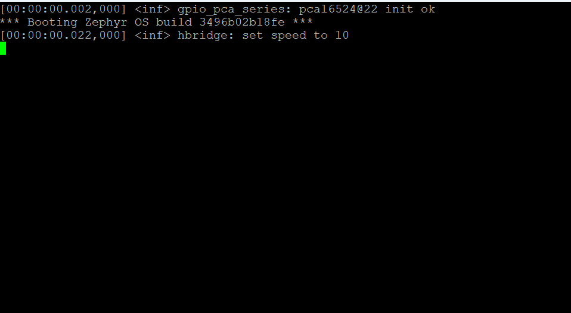
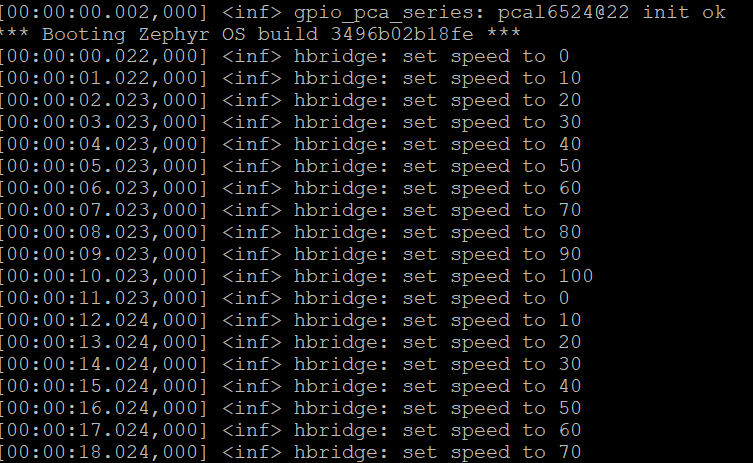

.. _hbridge-sample:

hbridge
=======

Description
-----------

This sample demonstrates the functionality of the `L298N`_ H-BRIDGE module.
This is done by either adjusting the speed of the motors from 0% to 100%
using a step size of 10% or by making the car more forward and then backwards
for a given amount of seconds.

Purpose
-------

Use this sample to check if you've successfully managed to hook up the L298N
H-BRIDGE module to your development board.

Hardware
--------

This sample requires the L298N H-BRDIGE module be connected to the development
board. Information on how to set up the H-BRIDGE module can be found here:
:ref:`l298n-hw`.

Where to find?
--------------

This sample is located under: ``samples/hbridge``.

API reference
-------------

You can find the API documentation `here <../doxygen/hbridge_8h.html>`_.

Configurations
--------------

This sample comes with the following configuration options:

1. ``CONFIG_NXPCUP_DIRECTION_SAMPLE``: if set to ``y``, the sample will demonstrate
   how the module can be used to change the direction of the car (forward, stop,
   backwards). Otherwise, if set to ``n``, the sample will demonstrate how the module
   can be used to change the speed of the car (from 0% to 100%).

See :ref:`configuring-your-application` for a tutorial on how to set this
configuration.

.. _hbridge-sample-how-to-build:

How to build
------------

To build this sample, run:

.. tabs::

   .. group-tab:: Linux

      .. code-block:: bash

         west build -p -b frdm_imx93//a55 samples/hbridge -D DTC_OVERLAY_FILE=frdm_imx93.overlay

   .. group-tab:: Windows

      .. code-block:: powershell

         west build -p -b frdm_imx93//a55 samples\hbridge -D DTC_OVERLAY_FILE=frdm_imx93.overlay

The resulting binary may be found under: ``build/zephyr/zephyr.bin``.

.. _hbridge-sample-how-to-run:

How to run
----------

To run this sample, follow the steps detailed in :ref:`booting-the-board`.

Expected behavior
-----------------

If ``CONFIG_NXPCUP_DIRECTION_SAMPLE`` is set to ``y`` and everything went well,
your serial console (``ttyACM1``/``COM4``) should display a message similar
to the one showcased below:

If ``CONFIG_NXPCUP_DIRECTION_SAMPLE`` is set to ``n``, the console should print
something like this:

If ``CONFIG_NXPCUP_DIRECTION_SAMPLE`` is set to ``y``, you should expect the
motors to spin forward for 5 seconds, stop for 1 second, spin backwards
for 5 seconds, and stop for 1 second. This cycle should be repeated in an
endless loop.

If ``CONFIG_NXPCUP_DIRECTION_SAMPLE`` is set to ``n``, you should expect the
motors to keep spinning faster and faster in the same direction (forward) until
the maximum speed is reached. Once there, the speed should be reset to 0% and
the process should start over. This cycle should be repeated in an endless loop.

.. _L298N: https://www.st.com/resource/en/datasheet/l298.pdf
