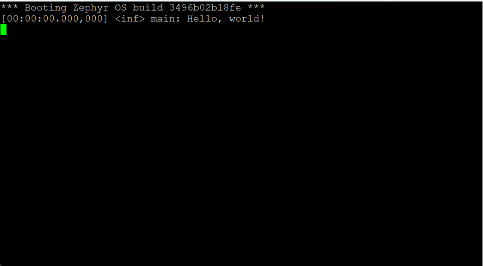

.. _hello-world-sample:

hello_world
===========

Description
-----------

This sample prints a ``Hello, world`` message to the serial console and then quits.

Purpose
-------

Use this sample to check if your board has booted successfully.

Hardware
--------

This sample requires no additional hardware.

Where to find?
--------------

This sample is located under: ``samples/hello_world``.

Configurations
--------------

This sample has no configurable feats.

How to build
------------

To build this sample, run:

.. tabs::

   .. group-tab:: Linux

      .. code-block:: bash

         west build -p -b frdm_imx93//a55 samples/hello_world

   .. group-tab:: Windows

      .. code-block:: powershell

         west build -p -b frdm_imx93//a55 samples\hello_world

The resulting binary may be found under: ``build/zephyr/zephyr.bin``.

How to run
----------

To run the sample, follow the steps detailed in :ref:`booting-the-board`.

Expected behavior
-----------------

If everything went well, your serial console (``ttyACM1``/``COM4``) should
display a message similar to the one showcased below:

