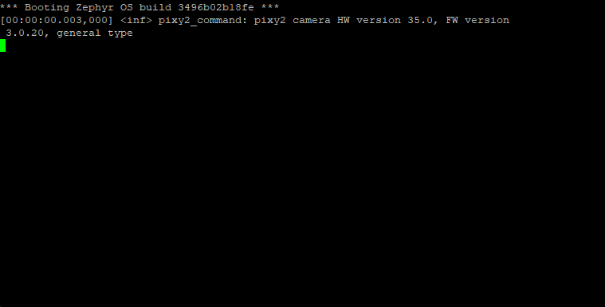

.. _pixy2-sample:

pixy2
=====

Description
-----------

This sample showcases the communication between the development board and the
`Pixy2`_ camera. This is done by first printing some information regarding the
camera's firmware and hardware, turning on the upper two LEDs and, finally,
using the bottom RGB LED to switch from one color to another using linear
interpolation.

Purpose
-------

Use this sample to check if you've successfully managed to hook up the Pixy2
camera to your development board. Furthermore, if you wish to use a different
protocol to communicate with the camera, you may use this sample to check if
the communication is sane.

Hardware
--------

This sample requires the Pixy2 camera be connected to the development
board. Information on how to set up the camera can be found here:
:ref:`pixy2-camera-hw`.

Where to find?
--------------

This sample is located under: ``samples/pixy2``.

API reference
-------------

The API is split into three main parts:

1. `The transport API <../doxygen/pixy2__transport_8h.html>`_.
2. `The protocol API <../doxygen/pixy2__protocol_8h.html>`_.
3. `The command API <../doxygen/pixy2__command_8h.html>`_.

Configurations
--------------

This sample comes with the following configuration options:

1. ``CONFIG_NXPCUP_PIXY2_I2C_TRANSPORT``: set to ``y`` if you want to use I2C
   to communicate with the Pixy2 camera.

2. ``CONFIG_NXPCUP_PIXY2_SPI_TRANSPORT``: set to ``y`` if you want to use SPI
   to communicate with the Pixy2 camera.

.. warning::

   ``CONFIG_NXPCUP_PIXY2_I2C_TRANSPORT`` and ``CONFIG_NXPCUP_PIXY2_SPI_TRANSPORT``
   should be mutually exclusive. Therefore, if you set one of them to ``y``, make
   sure the other is set to ``n``.

See :ref:`configuring-your-application` for a tutorial on how to set these
configurations.

.. _pixy2-sample-how-to-build:

How to build
------------

To build this sample, run:

.. tabs::

   .. group-tab:: Linux

      .. code-block:: bash

         west build -p -b frdm_imx93//a55 samples/pixy2 -D DTC_OVERLAY_FILE=frdm_imx93.overlay

   .. group-tab:: Windows

      .. code-block:: powershell

         west build -p -b frdm_imx93//a55 samples\pixy2 -D DTC_OVERLAY_FILE=frdm_imx93.overlay

The resulting binary may be found under: ``build/zephyr/zephyr.bin``.

.. _pixy2-sample-how-to-run:

How to run
----------

To run the sample, follow the steps detailed in :ref:`booting-the-board`.

Expected behavior
-----------------

If everything went well, your serial console (``ttyACM1``/``COM4``) should
display a message similar to the one showcased below:

Furthermore, the camera's upper two LEDs should be turned on, while the bottom
RGB LED continuously loops between colors:

.. image:: ../_static/figures/pixy2_video.gif
   :align: center
   :scale: 70

.. _Pixy2: https://pixycam.com/pixy2/
