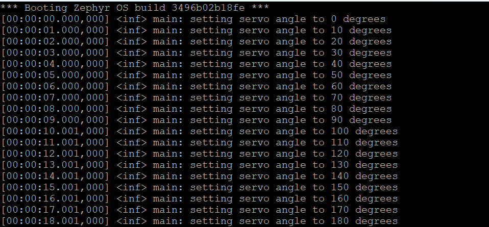

.. _servo-sample:

servo
=====

Description
-----------

This sample demonstrates the functionality of the `MG996R`_ servo motor. This
is done by endlessly varying the current angle from 0 degress (leftmost position)
to 180 degrees (rightmost position) using a step size of 10 degress. As per the
`MG996R`_ datasheet, the period of the PWM signal is set to 20ms.

Purpose
-------

Use this sample to check if you've successfully managed to hook up the MG996R
servo motor to your development board.

Hardware
--------

This sample requires the MG996R servo motor be connected to the development
board. Information on how to set up the servo motor can be found here:
:ref:`mg996r-hw`.

Where to find?
--------------

This sample is located under: ``samples/servo``.

API reference
-------------

You can find the API documentation `here <../doxygen/servo_8h.html>`_.

Configurations
--------------

This sample has no configurable feats.

.. _servo-sample-how-to-build:

How to build
------------

To build this sample, run:

.. tabs::

   .. group-tab:: Linux

      .. code-block:: bash

         west build -p -b frdm_imx93//a55 samples/servo -D DTC_OVERLAY_FILE=frdm_imx93.overlay

   .. group-tab:: Windows

      .. code-block:: powershell

         west build -p -b frdm_imx93//a55 samples\servo -D DTC_OVERLAY_FILE=frdm_imx93.overlay

The resulting binary may be found under: ``build/zephyr/zephyr.bin``.

.. _servo-sample-how-to-run:

How to run
----------

To run the sample, follow the steps detailed in :ref:`booting-the-board`.

Expected behavior
-----------------

If everything went well, your serial console (``ttyACM1``/``COM4``) should
continuously display messages similar to the ones shown below:

Furthermore, the motor's rotation angle should change by 10 degrees every
second as shown below [#]_, [#]_:

.. image:: ../_static/figures/servo_video.gif
   :align: center
   :scale: 70

.. _MG996R: https://www.handsontec.com/dataspecs/motor_fan/MG996R.pdf
.. [#] Video is not real time
.. [#] Notice the movement of the front wheels?
