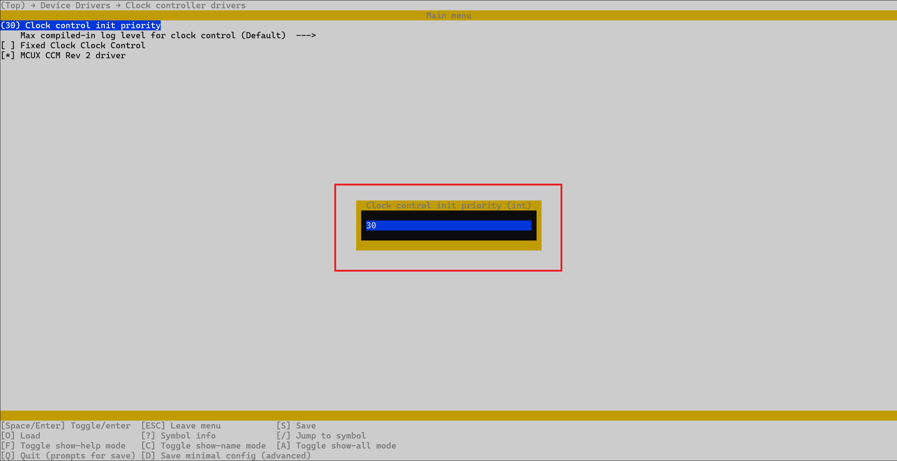

.. _configuring-your-application:

Configuring your application
============================

Much like the Linux kernel, Zephyr allows its users to configure the
kernel/application at build time through the usage of the `Kconfig`_-based
configuration system. This can be used to, for example, enable optional
features.

Interactive configuration
-------------------------

Users can choose to configure their application interactively, through the
usage of the ``menuconfig`` interface.

.. _opening-the-menuconfig-itf:

Opening the ``menuconfig`` interface
~~~~~~~~~~~~~~~~~~~~~~~~~~~~~~~~~~~~

To open up the ``menuconfig`` interface, you'll first have to build your
application. For example, assuming we want to configure the ``pixy2`` sample,
based on the :ref:`pixy2-sample-how-to-build` section, we'd first have to run:

.. code-block:: bash

   west build -p -b frdm_imx93//a55 samples/pixy2 -D DTC_OVERLAY_FILE=frdm_imx93.overlay

If the compilation was successful, the project tree should now contain a new
directory called ``build``. With this, you can now open the ``menuconfig``
interface by running:

.. code-block:: bash

   ninja -C build menuconfig

If all went well, you should now be greeted by an interface similar to the
one shown in :numref:`menuconfig-itf`.

.. _menuconfig-itf:

   Menuconfig interface

.. _menuconfig-navigating:

Navigating through the ``menuconfig`` interface
~~~~~~~~~~~~~~~~~~~~~~~~~~~~~~~~~~~~~~~~~~~~~~~

To navigate between the different entries, you can use the up and down
arrow keys. The currently selected item is highlighted in blue as shown
in :numref:`menuconfig-itf`.

To exit the interface you can use the ``Q`` key (capital letter).

To close the current menu and go back to the previous one, you can use
the ``ESC`` key. Pressing the ``ESC`` key while in the main menu (shown
in :numref:`menuconfig-itf`) will result in exiting the interface.

To save your current settings, you can use the ``S`` key (capital letter).
Doing so will result in a prompt similar to the one shown in
:numref:`menuconfig-save-prompt` appearing. Once you see this prompt, you'll
need to press the ``ENTER`` key twice to confirm.

.. _menuconfig-save-prompt:

   Menuconfig save prompt

Alternatively, if you're done with the configuration process, you can
directly close the ``menuconfig`` interface (via the ``Q`` or ``ESC`` keys).
If you've made any changes, ``menuconfig`` will ask you if you want to
save your changes before quitting via a prompt similar to the one shown
in :numref:`menuconfig-quit-save-prompt`.

.. _menuconfig-quit-save-prompt:

   Menuconfig save prompt before quitting

Pressing ``Y`` (capital letter) will result in ``menuconfig`` saving your
changes and then closing.

Searching for configuration options
~~~~~~~~~~~~~~~~~~~~~~~~~~~~~~~~~~~

If you're interested in looking for a particular configuration option,
you can use the search interface, which can be accessed by pressing the
``/`` key. Once open (see :numref:`menuconfig-search`), you can now type
in the name of your configuration option.

.. _menuconfig-search:

   Menuconfig search interface

The name of the configuration option you type in must not contain
the ``CONFIG_`` prefix. For example, assuming we're interested in
looking for the ``CONFIG_CLOCK_CONTROL_INIT_PRIORITY`` option, we'd
simply type in ``CLOCK_CONTROL_INIT_PRIORITY`` as shown in
:numref:`menuconfig-search-example`.

.. _menuconfig-search-example:

   Menuconfig search example

We can then use the up and down arrow keys to navigate through the search
results.

.. _printing-help-information:

Printing help information
~~~~~~~~~~~~~~~~~~~~~~~~~

Sometimes the ``menuconfig`` entries are not descriptive enough and you
might require additional information (such as the name of the associated
configuration option, its type, etc..). In such cases, you can use the
``?`` key to print help information on the currently selected entry
(highlighted in blue as shown in :numref:`menuconfig-itf`). For example,
:numref:`menuconfig-help` shows the help infromation printed for the
entry highlighted in :numref:`menuconfig-itf`.

.. _menuconfig-help:

   Menuconfig help

If you want to close the help menu, you can just press the ``ESC`` key.

.. _menuconfig-entries:

Menuconfig entries
~~~~~~~~~~~~~~~~~~

The ``menuconfig`` interface is made up of several prompts (or entries), each
of which offering a very brief description for a configuration option or a menu.
For example, looking at :numref:`menuconfig-itf`, we can identify the following
prompts:

1. **Use I2C as the underlying transport protocol**
2. **Use SPI as the underlying transport protocol**
3. **Devicetree Info**
4. **Modules**

and so on and so forth. Based on the underlying type (i.e. a configuration option
or a menu), these prompts will also contain some additional symbols. For example:

1. The **Use I2C as the underlying transport protocol** prompt has the ``[*]``
   symbol in the beginning.
2. The **Use SPI as the underlying transport protocol** prompt has the ``[*]``
   symbol in the beginning.
3. The **Devicetree Info** prompt has the ``----`` symbol after it.
4. The **Modules** prompt has the ``--->`` symbol after it.

and so on and so forth. Generally, the ``----`` and ``--->`` symbols will be
used to identify menus, while the rest will be used for configuration options.
You can think of a menu as a way to group configuration options based on
subsystem, functionality, etc.., but keep in mind that menus can also contain
other menus and not just configuration options.

**Menus**

As for the menu-related symbols, ``--->`` is used to identify selectable
menus, while the ``----`` symbol is used for non-selectable menus. You'll
most likely want to ignore menus marked with the ``----`` symbol.

To open up a menu, you'll first have to select it using the up and down
arrow keys and then press the ``ENTER`` key. If the menu is not selectable
(i.e. it is marked with the ``----`` symbol), pressing the ``ENTER`` key
will not do anything.

For example, assuming we want to open the **ARM64 Options** menu, we'll
first have to navigate to it as shown in :numref:`menuconfig-arm64-options`.

.. _menuconfig-arm64-options:

   Navigating to the **ARM64 Options** menu

And then we can open it by pressing the ``ENTER`` key. This will result in
the menu shown in :numref:`menuconfig-arm64-options-menu`.

.. _menuconfig-arm64-options-menu:

   Opening the **ARM64 Options** menu

**Configuration options**

All configuration options have a name, a type, and a value. If you're working
with C, cmake, etc.. (roughly, anything that's not Kconfig), the name of the
configuration options will always contain the ``CONFIG_`` prefix. For instance:

1. ``CONFIG_NXPCUP_PIXY2_I2C_TRANSPORT``
2. ``CONFIG_NXPCUP_PIXY2_SPI_TRANSPORT``
3. ``CONFIG_REQUIRES_FULL_LIBC``

and so on. If however, you're working with Kconfig, you're going to have to
drop the ``CONFIG_`` prefix if you, for example, want to search for the option
using ``menuconfig``.

As for the config option type, you'll most likely be working with just two
of them: boolean and integer. The boolean type (also known as just ``bool``)
takes yes (``y``) or no (``n``) as values, while, intuitively, the integer
(also known as just ``int``) type takes integers as value (e.g. 100, -5, 4, 56, etc..).

You can find the type of an underlying configuration option by either
looking at the symbol that's added before the prompt:

1. ``[]`` for boolean options
2. ``()`` for integer options

or by opening the help menu as showcased in :ref:`printing-help-information`
and looking at the **Type** field.

Just like the ``----`` symbol that's used for menus, configuration options
have the ``--`` symbol which is used to mark configs that are not modifiable
(i.e. you can't set a value to it).

**Modifying a configuration option**

To modify the value of a configuration option, you'll first have to select
it using the up and down arrow keys and then press ``ENTER``. Based on the
type of the option, you'll see the following actions happening:

1. For boolean types, you'll see an asterisk appearing/disappearing inside
   the ``[]`` symbol. A ``[*]`` symbol means the config was assigned the
   value ``y`` (yes), while a ``[ ]`` symbol means the config was assigned
   the value ``n``.

2. For integer types, you'll be prompted to enter the new value as shown in
   :numref:`menuconfig-int-prompt`. Once done, make sure you press ``ENTER``.

.. _menuconfig-int-prompt:

   Setting an integer configuration option

When you're done changing the value of your config, make sure to save
your choices as detailed in :ref:`menuconfig-navigating`.

Once you're done with everything, you can close the ``menuconfig``
interface and re-compile your application.

.. warning::

   The configuration performed through ``menuconfig`` is not persistent,
   meaning you'll lose all changes if you compile the application using
   the ``-p`` flag.

   Therefore, if you choose this method, you should omit the ``-p`` flag
   after performing the changes through ``menuconfig``.

Using configuration options in your C code
~~~~~~~~~~~~~~~~~~~~~~~~~~~~~~~~~~~~~~~~~~

During the build process, Zephyr will generate an ``autoconf.h`` header
file with the definitions of the configuration options and their values.
If you inspect this file (which you should be able to find under
``build/zephyr/include/generated/zephyr/autoconf.h``), you'll notice that
each configuration option is defined as a macro. For boolean types, if the
config was assigned the value ``y``, the associated macro will be defined
and will expand to the value ``1``. For instance:

.. code-block:: c

   /* if NXPCUP_PIXY2_I2C_TRANSPORT is set to n, this config will not be defined at all! */
   #define CONFIG_NXPCUP_PIXY2_I2C_TRANSPORT 1

On the other hand, if the config is assigned the value ``n``, the associated
macro will not be defined at all. The example below shows you how you can
test if a config was assigned the value ``y`` and perform actions based on
that:

.. code-block:: c

   int main(void) {
   #ifdef CONFIG_NXPCUP_PIXY2_I2C_TRANSPORT
      LOG_INF("Hello, world!");
   #else
      LOG_INF("Goodbye, world!");
   #endif /* CONFIG_NXPCUP_PIXY2_I2C_TRANSPORT */
      return 0;
   }

If ``CONFIG_NXPCUP_PIXY2_I2C_TRANSPORT`` is set to ``y``, your application
will print the ``Hello, world!`` message. Otherwise, it will print the
``Goodbye, world!`` message.

For integer types, the associated macro should always be defined and will
expand to the configured value.

.. _non-interactive-configuration:

Non-interactive configuration
-----------------------------

.. note::

   While you're still getting used to the development environment, we
   recommend using this method instead of the interactive configuration
   as it should be less prone to errors/mistakes.

As discussed in :ref:`menuconfig-entries`, the configuration performed through
``menuconfig`` is not persistent. To overcome this, you can opt for the
non-interactive configuration option, which makes use of the ``prj.conf`` file.

Each Zephyr application must have a ``prj.conf`` file, even if it's empty. In
the context of this project, each sample application has the ``prj.conf`` file
stored under ``samples/<sample_name>/prj.conf``, while the starting point for
your application has it stored under ``src/prj.conf``.

The ``prj.conf`` file is made up of multiple entries, each of which with the
following format:

.. code-block:: text

   <config_name>=<value>

where:

* ``config_name``: name of the configuration option to modify. The name must
  contain the ``CONFIG_`` prefix. For example: ``CONFIG_NXPCUP_PIXY2_SPI_TRANSPORT``.

* ``value``: value to assign to the config

Therefore, setting the value of a config option is as simple as adding a new
line to the ``prj.conf`` file. For example, assuming we want to set
``CONFIG_NXPCUP_PIXY2_SPI_TRANSPORT`` to ``y`` for the ``pixy2`` sample, we'd
have to add the following line to ``samples/pixy2/prj.conf``:

.. code-block:: kconfig

   CONFIG_NXPCUP_PIXY2_SPI_TRANSPORT=y

After modifying the ``prj.conf`` file, you can re-compile the application as
you normally would (using the ``-p`` flag). You also have the option of verifying
if you configuration was saved by opening up ``menuconfig`` and looking at
the value that was assigned to your config (needs to be done after the re-compilation).

Further reading
---------------

1. https://docs.zephyrproject.org/latest/build/kconfig/index.html
2. https://docs.zephyrproject.org/latest/build/kconfig/menuconfig.html

.. _Kconfig: https://www.kernel.org/doc/html/latest/kbuild/kconfig-language.html
