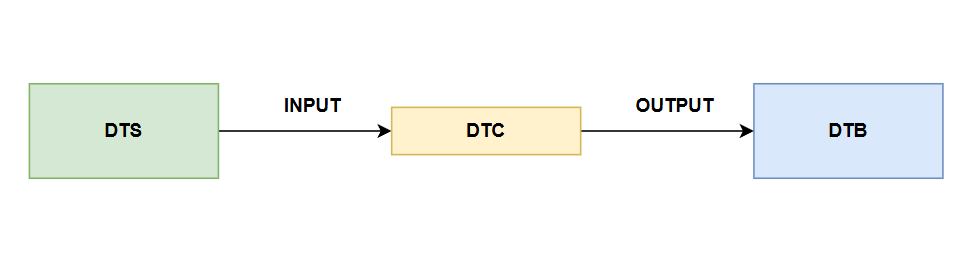

.. _devicetree-basics:

Devicetree basics
=================

What is a devicetree?
---------------------

The **devicetree** is a tree-like data structure used by operating systems
such as Linux and Zephyr [#]_ to discover [#]_ and initialize the hardware
found on a system (e.g. FRDM-IMX93). In this format, the hardware devices
are represented as **nodes**, each of which having a set of **properties**.
Each devicetree node has exactly **one** parent and is a descendant of the
**root** node (known as ``/``). :numref:`devicetree-diagram-example` provides
an example representation of a devicetree.

.. _devicetree-diagram-example:

   Devicetree example representation

In this particular example, the root node (``/``) has two children: **CPUS**
and **MEMORY** (ignore the bit after ``@`` for now), representing a CPU cluster
(i.e. a set of CPU cores) and some memory. In turn, the **CPUS** node has a
single child: **CPU** (ignore the bit after ``@`` for now), representing a single
CPU core. Based on this information, we can conclude that the system we're dealing
with has a single CPU core and some memory.

Additionally, we can see that all nodes have a set of properties: **PROPERTY 1**
and **PROPERTY 2**, respectively that can be used to, for example, provide
additional information about the underlying hardware. For example, you'll most
likely want to specify the **size** of the memory.

Although all nodes depicted in :numref:`devicetree-diagram-example`  have the
same properties, this is **NOT** a requirement. Usually, each node will have
its own set of properties, which might differ from that of the other nodes.

The devicetree source and devicetree blob
-----------------------------------------

Much like the compiled programming languages such as C, the devicetree has a
textual representation known as the **devicetree source (DTS)**, which is meant
for us, humans. This means that you can read and write a DTS as you normally
would with any other text file.

The textual representation of a devicetree is not really suited to be used by
the OS, which is why the devicetree also has a binary representation, which
is known as the **devicetree blob (DTB)** or **flattened devicetree (FDT)** [#]_.
The DTS is converted into its binary form via a process called **compilation**
(similar to how you'd compile a C source file) by a tool known as the
**devicetree compiler (DTC)**. :numref:`devicetree-compilation` emphasizes the
relationship between the three components. The DTC takes a devicetree source
as input, compiles it, and produces a DTB, which can then be used by your OS.

.. _devicetree-compilation:

   Relationship between the DTS, DTB, and DTC.

To identify a DTS file, you can look at its extension, which, in most cases,
will be ``.dts``. On the other hand, devicetree blobs will usually end in
``.dtb``.

Writing a devicetree source file
--------------------------------

As previously mentioned, the devicetree is a tree-like data structure,
which is why the DTS file is made up of nodes defining hardware devices.

Devicetree nodes
~~~~~~~~~~~~~~~~

The definition of a devicetree node is shown below:

.. code-block:: text

   node-name@unit-address {
      /* properties or other node definitions go here */
   };

where:

* ``node-name``: name of the node. This is usually chosen such that
  it reflects the functionality of the underlying device (e.g. cpu, memory,
  adc, etc..) and should, ideally, be chosen from the list shown in
  the `devicetree specification`_, section **Generic Names Recommendation**.

* ``@unit-address``: this bit is optional and can be used to distinguish
  between devices with the same functionality (e.g. a machine may have 4
  CPUs). Its meaning is relative to the bus the hardware device sits on.
  However, usually, the ``unit-address`` bit will be set to the start of
  the device's address space.

The name of the root devicetree node must be set to ``/``. Thus, its
definition would be:

.. code-block:: text

   / {
      /* properties or other node definitions go here */
   };

Devicetree nodes defined within the context of other devicetree nodes
form a child-parent relationship. For example:

.. code-block:: text

   / {
      node-1 {
      };

      node-2 {
      };

      node-3 {
      };
   };

``node-1``, ``node-2``, and ``node-3`` are all children of the root node.
Additionally, these tree nodes are placed on the same level.

With this in mind, we'd describe the hardware topology shown in
:numref:`devicetree-diagram-example` as follows:

.. code-block::

   /* node properties were intentionally omitted */

   / {
     cpus {
       cpu@0 {
       };
     };

     memory@1000 {
     };
   };

Devicetree node labels
~~~~~~~~~~~~~~~~~~~~~~

A devicetree node may also contain a label. In such cases, the format of the
node is:

.. code-block:: text

   node-label: node-name@unit-address {
      /* properties or other node definitions go here */
   };

where:

* ``node-label``: name of the label to attach to said node. Needs to be unique.

After adding a label, you can then use the ``&`` operator, followed by the
name of the node label (i.e. ``&node-label``), to reference the node inside
a property or a devicetree source file.

Some examples are presented below:

1. **Referencing a node inside another node's property:**

.. code-block:: text

   my_amazing_label: my-node {
     /* properties or other node definitions go here */
   };

   my-other-node {
     my-property = <&my_amazing_label>;
   };

2. **Referencing a node defined in the DTSI:**

.. code-block:: text

   /* content of my-example.dtsi */

   some_label: my-node {
     status = "disabled";
   };

.. code-block:: text

   /* content of my-example.dts */

   /* include the nodes defined in my-example.dtsi */
   #include "my-example.dtsi"

   /* change "my-node"'s status from "disabled" to "okay"
   &some_label {
     status = "okay";
   };

Devicetree node properties
~~~~~~~~~~~~~~~~~~~~~~~~~~

As mentioned earlier, each node can have a set of properties, thus allowing
developers to provide additional information about the underlying hardware
(e.g. the address space of a device). The format of a property is shown
below:

.. code-block:: text

   my-node {
     <property_name> = <property_value>;
   };

where:

* ``property_name``: name of the property
* ``property_value``: value of the property

Below you may find a list of some of the most commonly used
properties and their meanings.

The ``compatible`` property
~~~~~~~~~~~~~~~~~~~~~~~~~~~

**Description**

Used to describe the programming model for a given device. An operating
system might use this property to, for example, choose the suitable
device driver.

**Format**

The format of the property is shown below:

.. code-block:: text

   my-node {
     compatible = <stringlist>;
   };

where:

* ``stringlist``: list of null terminated strings describing the programming
  model. For example: ``"fsl,aips-bus"``, ``"fsl,aips-bus"``, etc..

**Examples**

Below you may find some example node definitions:

.. code-block:: text

   aips1: bus@30000000 {
     compatible = "fsl,aips-bus", "simple-bus";
     /* other properties were intentionally omitted */
   };

.. code-block:: text

   gpio1: gpio@30200000 {
     compatible = "fsl,imx8mp-gpio", "fsl,imx35-gpio";
     /* other properties were intentionally omitted */
   };

The ``status`` property
~~~~~~~~~~~~~~~~~~~~~~~

**Description**

Used to describe the operational status of the device.

**Format**

The format of the property is shown below:

.. code-block:: text

   my-node {
     status = <string>;
   };

where:

* ``string``: null terminated string.

As per the `devicetree specification`_, section 2.3.4, **status**, the value
of the ``status`` property may be one of (you'll most likely end up working
with just the first two):

1. ``"okay"``: device is operational.
2. ``"disabled"``: device is not currently operational but may become in the future.
3. ``"reserved"``
4. ``"fail"``
5. ``"fail-sss"``

.. note::

   If a node doesn't have the ``status`` property, it is assumed that the
   device is operational (i.e. equivalent to ``status = "okay";``).

**Examples**

Below you may find some example node definitions:

.. code-block:: text

   wdog3: watchdog@302a0000 {
     /* other properties were intentionally omitted */
     status = "disabled";
   };

.. code-block:: text

   flexspi: spi@30bb0000 {
     /* other properties were intentionally omitted */
     status = "okay";
   };

.. code-block:: text

   /* this node doesn't have the status property. This is equivalent
    * to explicitly having the status property set to "okay".
    */
   usdhc3: mmc@30b60000 {
     /* other properties were intentionally omitted */
   };

The ``#address-cells`` and ``#size-cells`` properties
~~~~~~~~~~~~~~~~~~~~~~~~~~~~~~~~~~~~~~~~~~~~~~~~~~~~~

**Description**

Used to specify the number of ``u32`` cells that make up the
address and size fields in a child node's ``reg`` property.
Consequently, this property is specified inside nodes that have children.

**Format**

The format of the property is shown below:

.. code-block:: text

   my-node {
     #address-cells = <u32>;
     #size-cells = <u32>;
   };

where:

* ``u32``: unsigned 32-bit integer value

If missing, it is assumed that ``#address-cells`` is set to ``2`` and
``#size-cells`` is set to ``1``.

**Examples**

Below you may find some example node definitions:

.. code-block:: text

   /* in this example, we expect the address and size fields of the
    * children to be made up of two 32-bit cells (i.e. both of them
    * will be 64-bit).
    */
   my-parent {
     #address-cells = <2>;
     #size-cells = <2>;

     /* other properties were intentionally omitted */

     child-1 {
     };

     child-2 {
     };
   };

.. code-block:: text

   /* in this example, we expect the address field to be made up of
    * two 32-bit cells (i.e. address will be 64-bit). The size field
    * will be made up of 1 32-bit cell (i.e. size will be 32-bit).
    */
   my-parent {
     #address-cells = <2>;
     #size-cells = <1>;

     /* other properties were intentionally omitted */

     child-1 {
     };

     child-2 {
     };
   };

The ``reg`` property
~~~~~~~~~~~~~~~~~~~~

**Description**

Used to describe the address space of a device in the context of a bus.

**Format**

The format of the property is shown below:

.. code-block:: text

   my-node {
     reg = <prop-encoded-array>;
   };

where:

* ``prop-encoded-array``: list of ``(address, size)`` pairs.

The ``address`` field is made up of ``N``, ``u32`` values, where ``N`` is
the value specified via the ``#address-cells`` property in the parent node.

The ``size`` field is made up of ``M``, ``u32`` values, where ``M`` is
the value specified via the ``#size-cells`` property in the parent node.

**Examples**

Below you may find some example node definitions:

.. code-block:: text

   /* assume that the parent has:
    *
    * #address-cells = <1>;
    * #size-cells = <1>;
    */
    my-child@3000 {
      /* the address space of this device starts from 0x3000 and
       * ends at 0x7000 (since the size is set to 0x4000 bytes)
       */
      reg = <0x3000 0x4000>;
    };

    my-child@50000000 {
      /* this device has two address spaces:
       *
       * 1) First spanning from 0x50000000 to 0x50001000
       * 2) Second spanning from 0x50001000 to 0x50002000
       */
      reg = <0x50000000 0x1000>, <0x50001000 0x1000>;
    };

.. code-block:: text

   /* assume that the parent has:
    *
    * #address-cells = <2>;
    * #size-cells = <2>;
    */
   my-child@100000000 {
     /* the address space of this device starts from 0x100000000
      * (this address results from concatenating 0x1 and 0x0)
      * and ends at 0x100001000 (this size results from concatenating 0x0
      * and 0x1000)
      */
     reg = <0x1 0x0 0x0 0x1000>;
   };

.. note::

   If the ``reg`` property is present, you **must** specify the node's
   unit address in the node name (i.e. the bit after @).

   The node's unit address must match the starting address of the address
   space.

Devicetree source include files
-------------------------------

When developing an application written in C, you may choose to add some
of your function/structure/macro definitions inside a header file, which
will allow you to use said definitions in multiple locations.

In the context of devicetrees, the equivalent of a header file is called
a **devicetree source include (DTSI)**, which is usually used to provide
node definitions for an SoC. This file is then included in your board's
DTS.

To include a DTSI in your DTS, you can use the C preprocessor ``#include``
directive as follows: ``#include <name_of_your_dtsi>``.

Below, you may find an example DTSI called ``my-example.dtsi``:

.. code-block:: text

   /* content of my-example.dtsi */
   my-node-1 {
   };

   my-node-2 {
   };

   my-node-3 {
   };

You can include the node definitions from ``my-example.dtsi`` by adding
a ``#include "my-example.dtsi"`` statement in the beginning of your DTS:

.. code-block:: text

   /* content of my-example.dts */

   /* this pulls in the node definitions from my-example.dtsi */
   #include "my-example.dtsi"

   my-node-4 {
   };

   my-node-5 {
   };

After preprocessing, this results in the following ``my-example.dts`` file:

.. code-block:: text

   my-node-1 {
   };

   my-node-2 {
   };

   my-node-3 {
   };

   my-node-4 {
   };

   my-node-5 {
   };

Therefore, largely speaking, what the preprocessor does is it takes the
node definitions from your DTSI and adds them to your DTS file.

Furthermore, you may have the same node definitions in your DTS and
DTSI files. For example:

.. code-block:: text

   /* content of my-example.dtsi */

   my-node {
     compatible = "v1,m1";
     /* this is a boolean property, which takes no value. Specifying its name is enough */
     my-amazing-property;
     status = "disabled";
   };

.. code-block:: text

   /* content of my-example.dts */

   #include "my-example.dtsi"

   my-node {
     status = "okay";
   };

As you can see, both the DTSI and DTS define the ``my-node`` node.
In this particular case, the preprocessor will merge the two node
definitions. If both of the nodes have the same property with different
values (e.g. ``status`` is set to ``disabled`` in the DTSI and set to ``okay``
in the DTS), the resulting node will use the value set in the DTS
(e.g. in this case, ``my-node`` will have ``status`` set to ``okay``).
Otherwise, the resulting node will use the properties from both node
definitions.

With this in mind, the resulting node will have the following definition:

.. code-block:: text

   /* content of preprocessed my-example.dts */

   my-node {
     compatible = "v1,m1"; /* taken from the DTSI */
     my-amazing-property; /* taken from the DTSI */
     status = "okay"; /* taken from the DTS */
   };

If the devicetree node defined in the DTSI has a label, you can use that
instead of the node's name. For example:

.. code-block:: text

   /* content of my-example.dtsi */

   my_node_label: my-node {
     compatible = "v1,m1";
     my-amazing-property;
     status = "disabled";
   };

.. code-block:: text

   /* content of my-example.dts */

   #include "my-example.dtsi"

   &my_node_label {
     status = "okay";
   };

Devicetree overlays
-------------------

Certain applications require certain node configurations. In such cases, you
can customize the resulting DTB by applying a **devicetree overlay** to it.

Much like devicetree sources and blobs, devicetree overlays also have a
textual representation known as **devicetree source overlay (DTSO)** and a
binary representation known as **devicetree blob overlay (DTBO)**. The DTC
takes in a DTSO as input, compiles it, and produces an output DTBO. You can
then apply (i.e. the OS or compiler reads your DTB and DTBO and then merges
the content of the two) the DTBO to your DTB to modify the node definitions.

Let's look at an example:

.. code-block:: text

   /* content of my-example.dts */

   my-node-1 {
     compatible = "v1,m1";
     my-amazing-property;
   };

.. code-block:: text

   /* content of my-example.dtso */
   my-node-1 {
     compatible = "v2,m2";
   };

In this particular case, after the ``my-example`` DTBO is applied to the
DTB, ``my-node-1`` will have the following definition:

.. code-block:: text

   my-node-1 {
     compatible = "v2,m2";
     my-amazing-property;
   };

When applying devicetree overlay, the nodes are merged using the same logic
that's employed for DTSIs and DTSs.

Further reading
---------------

For additional information, the reader is encouraged to also check out the
`devicetree specification`_.

.. [#] The devicetree structure is OS-agnostic, thus its scope is not restricted
   to Zephyr and/or Linux.

.. [#] Some devices may not be connected to buses that support runtime discovery
   (like PCI does). In such cases, the hardware topology is described statically
   using the devicetree structure. The devicetree structure is usually used in
   embedded systems based on architectures such as ARM, RISC-V, etc..

.. [#] The name FDT stems from the fact the tree structure described in the DTS
   is flattened during the compilation process, thus resulting in linear binary
   data.

.. _devicetree specification: https://www.devicetree.org/specifications
