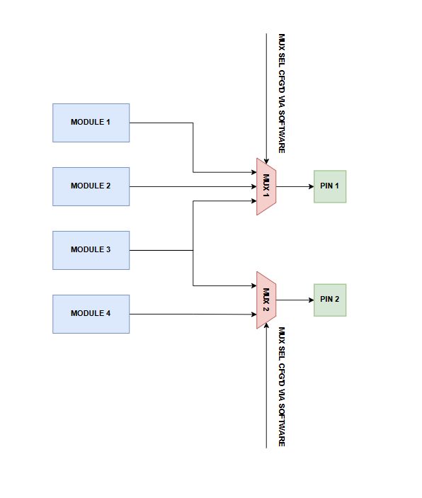
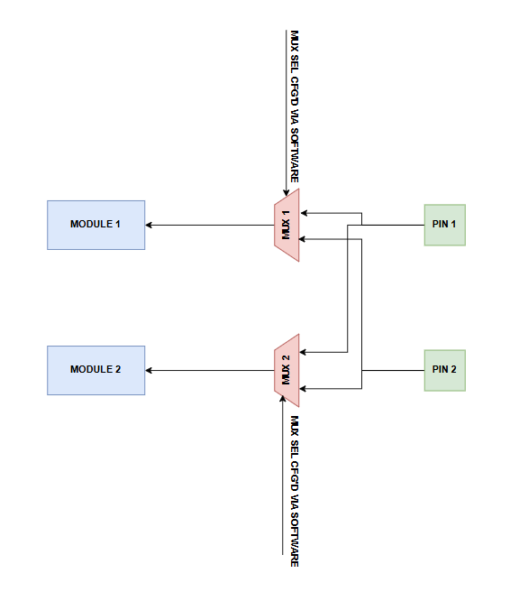

i.MX93 pin control
==================

Pin multiplexing
----------------

Thanks to the advancements in transistor technology and the ever-increasing
consumer applications' demands, the number of modules/IPs integrated in a
single SoC keeps increasing. Despite this, however, the number of pins exposed
by the packaging of the SoC remains relatively small compared to the number of
possible signals that need be routed to or from the chip.

A potential solution for this, which is employed by multiple chip vendors,
is to multiplex the signals from various modules using the same pin. The
decision of which module signal is routed through which pin is, thus, left
to the software developer.

.. _pin-muxing-example:

   Pin multiplexing example (output)

:numref:`pin-muxing-example` provides an example of an SoC with 4 modules/IPs and
2 pins. The output signals from modules 1-3 are passed through ``MUX 1``, while
the output signals are passed through ``MUX 2``. The output of ``MUX 1`` and
``MUX 2`` is routed through ``Pin 1`` and ``Pin 2``, respectively. The select
signals for the two multiplexers are configured by the software via a set of
hardware registers.

Based on the simplified example from :numref:`pin-muxing-example`, we can
imagine that all pins in an SoC have a multiplexer associated to them.
Connected to these multiplexers are the signals of various modules integrated
in the SoC.

The hardware topology showcased in :numref:`pin-muxing-example` only applies
to the output signals (i.e. the signals coming from the SoC modules and going
to the SoC pins). :numref:`pin-muxing-input-example` showcases the hardware
required for routing the input signals (i.e. the signals coming from the SoC
pins and going to the SoC modules).

.. _pin-muxing-input-example:

   Pin multiplexing example (input)

In this particular scenario, we have an SoC made up of two modules/IPs and
two pins. The signals coming from ``Pin 1`` and ``Pin 2`` are routed to
``MODULE 1`` and ``MODULE 2`` through ``MUX 1`` and ``MUX 2``. The select
signal for the multiplexers is, again, configured by the software through
a set of registers.

i.MX93 IOMUXC
-------------

For the i.MX93, the module that's in charge of configuring the pin
multiplexors is called the ``IOMUXC``. You can find more information
about this module by downloading the `i.MX93 TRM`_ and looking at
**Chapter 27**, **IOMUX Controller (IOMUXC)**.

Identifying the possible signals going through our pins
-------------------------------------------------------

Now that we've got a grasp on what pin multiplexing is, the next step
is to identify which pins we're interested in using and what signals
can be routed through this pins.

For our application development, we'll be using the FRDM-IMX93 expansion
header, which is depicted in :numref:`frdm-imx93-exp-gpio`. Its schematic
is depicted in :numref:`frdm-imx93-schematic-excerpt`. As we can see from
the schematic, the expansion header's pins are called ``EXP_GPIO_IOx``,
where ``x`` is the index of the pin. Although not shown in the schematic,
these pins are tied to the SoC's pads, which are called ``GPIO_IOx``, where
``x`` is the index of the pin. The mapping between the expansion header's
pins and the SoC's pads is the identity mapping (i.e. ``EXP_GPIO_IO00`` is
tied to ``GPIO_IO00``, ``EXP_GPIO_IO01`` is tied to ``GPIO_IO01`` and so on).

To determine which signals can be routed through ours pins, we can look at
**i.MX93 IOMUX** table [#]_ from the `i.MX93 schematic`_ [#]_. If you look
at the aformentioned table, you'll see that it has 10 columns (**PS**, **PE**,
**IS**, **IO** not included since we're not interested in them). The first
column, which is called **IOPAD** contains the name of the SoC pads. Assuming
we're interested in the ``EXP_GPIO_IO01`` pin (and the ``GPIO_IO01`` pad,
respectively), we can see that its corresponding pad (i.e. ``GPIO_IO01``) is
documented in the 10th row.

.. note::

   Always use the name of the pad instead of the net name that you see in
   the board schematic when trying to find which signals are multiplexed into
   the pin you're interested in.

The columns named ``Alt0`` through ``Alt7`` each contain the name of the module
signals that are multiplexed through this pin. Consequently, for the ``GPIO_IO01``
pad, we have the following signals:

1. gpio2.IO[1]
2. i2c3.SCL
3. isi.D[0]
4. lcdif.DE
5. spi6.SIN
6. uart5.RX
7. i2c5.SCL

Usually, the name of the signals follow the format shown below:

.. code-block:: text

   <module_name>.<signal_name>

, where:

* ``module_name``: name and, optionally, instance of the SoC module
* ``signal_name``: name of the module signal.

Now, let's try to analyze some of the aforementioned signals and see what
information we can deduce from their names:

1. gpio2.IO[1]: this signal belongs to the GPIO module, instance number 2.
   The ``[1]`` bit indicates that this is the second GPIO signal (since indexing
   starts at 0).

2. i2c3.SCL: this signal belongs to the I2C module, instance number 3.
   The name of this signal is SCL (i.e. the clock signal).

3. isi1.D[0]: this signal belong to the ISI module. The lack of an instance number
   here indicates that the SoC only has one instance of this module.

Most of the times, you'll be able to use the module name you've extracted from
the signal name to look up more information on it in the `i.MX93 TRM`_. However,
this isn't always the case. For instance, the name of the ``uart5.RX`` signal
would indicate that the module we're looking for is called ``UART`` (instance 5),
but this isn't true. Instead, the module is called ``LPUART``. Therefore, you might
have to do a bit more digging before being able to correctly identify the correct
module name.

Lastly, we have the ``DEF MUX`` column, which shows the default configuration of
the multiplexer. What this means is that after resetting the board, if no piece of
software configures the multiplexer, the signal that gets routed through our pin
is the one shown in the ``DEF MUX`` column. For the ``GPIO_IO01`` pad, that would
be ``gpio2.IO[1]``.

Pin configuration
-----------------

Apart from the multiplexors used to route signals to/from the SoC modules,
each pin may also contain additional components such as pull-up/pull-down
resistors, buffers, etc.., which can be configured by the software through
a set of registers. To give you an intuititon regarding the internal structure
of an SoC pin, you can have a look
`here <https://www.nxp.com/docs/en/application-note/AN5078.pdf>`__
(**Section 3.3**, **Internal structure of IOMUX**).

For the i.MX93 SoC, the IOMUXC also controls the pin configurations.
Unfortunately, the module documentation doesn't really enumerate all
of the available configuration options, which is why you'll have to
look at the definition of the register that's in charge of your pin.

Let's assume we're interested in the ``GPIO_IO01`` pin. First, we need to
locate the register that's in charge of this pin's configuration. To do so,
we need to look at the table presented in **Section 27.3.1.1** of the
`i.MX93 TRM`_. All of the registers that start with the ``SW_MUX_CTL_`` prefix [#]_
are in charge of the multiplexer configuration, while all of the registers
starting with the ``SW_PAD_CTL_`` prefix are in charge of the pin configurations.

In our particular example, the name of the register we're interested in
would be ``SW_PAD_CTL_PAD_GPIO_IO01``. From its definition, we can deduce
the following information:

1. The pin supports configuring the drive strength (DSE) and slew rate (FSEL1).
   These configurations affect how fast the pin can switch between the LOW and
   HIGH levels and the propagation delays.

2. The pin can have a pull-up resistor (PU).

3. The pin can have a pull-down resistor (PD).

4. The pin supports open-drain configuration (OD). This option is useful
   when using protocols such as I2C, where the bus is tri-stated.

Some of the aforementioned configuration options may not be available to
all pins, which is why it's recommended that you first check which
configuration options are available for your pins before attempting to
configure it.

.. _i.MX93 TRM: https://www.nxp.com/webapp/Download?colCode=IMX93RM
.. _i.MX93 schematic: https://www.nxp.com/webapp/Download?colCode=FRDM-iMX93-DESIGN-FILES
.. [#] You can find this table on the last page
.. [#] Have a look at :ref:`frdm-imx93-board-schematic` to find the name of the
   schematic file.
.. [#] The names of the registers are written between parantheses. For example,
   SW_MUX_CTL_PAD_DAP_TDI.
