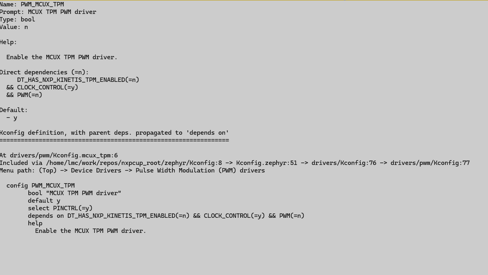
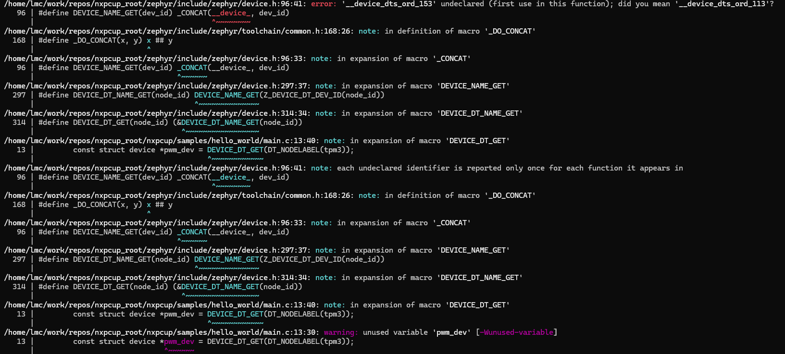

The Zephyr device driver model
==============================

The ``device`` structure
------------------------

In the context of operating systems, the term **device driver** is used to
refer to a piece of software, which is used to manage a hardware device.
Usually, based on the subsystem it resides in, the device driver will implement
a set of functions (known as an API), which can then be used by the upper layers
(e.g. the Zephyr kernel or your application) to perform certain tasks.

In the context of Zephyr, each hardware device is represented in the software
by a ``struct device``, which is used to hold information such as the device's
name, a pointer to the API functions, the device driver's private data etc... You
may find the definition of ``struct device``
`here <https://elixir.bootlin.com/zephyr/v4.2.0/source/include/zephyr/device.h#L510>`__.

As users, what we're mostly interested in here is that most (if not all) subsystem
APIs will require (directly or indirectly) a pointer to a ``struct device`` to use.
As an example, let's take a look at the PWM subsystem API, which you may find
`here <https://docs.zephyrproject.org/latest/doxygen/html/group__pwm__interface.html>`__
under the **Functions** section. As you can see, functions such as ``pwm_set_cycles()``,
``pwm_set()``, ``pwm_get_cycles_per_sec()`` etc.. take a pointer to a ``struct device``
as one of their parameters. Now, the question is: how do we obtain a pointer to this
structure?

Creating a ``struct device``
----------------------------

The Zephyr device drivers are the entities in charge of creating a
``struct device`` for all of the hardware devices they are managing.
For this to happen, however, the devicetree nodes will have to meet
the following criteria:

1. Have their status set to ``okay``.
2. Match one of the drivers' programming model.

Before going into details, it's important to clarify one thing: a device
driver can manage more than one instance of the same hardware device. For
instance, assuming that you have a SoC with two PWM controllers, the same
device driver will be used to manage both of the controllers. What differs,
however, is the ``struct device`` that's used since each of the controllers
will have a different ``struct device`` bound to them.

Now, let's consider the following PWM controller devicetree node as an example:

.. code-block:: devicetree

   /* taken and adapted from nxp_mimx93_a55.dtsi */

   tpm3: tpm@424e0000 {
       compatible = "nxp,kinetis-tpm";
       reg = <0x424e0000 DT_SIZE_K(64)>;
       interrupts = <GIC_SPI 75 IRQ_TYPE_LEVEL IRQ_DEFAULT_PRIORITY>;
       interrupt-names = "irq_0";
       interrupt-parent = <&gic>;
       clocks = <&ccm IMX_CCM_TPM3_CLK 0 0>;
       prescaler = <1>;
       #pwm-cells = <3>;
       status = "okay";
   };

The first thing we need to check is if the node is enabled. Therefore, we
need to check if the status property is set to ``okay`` or is missing
(in which case its value is assumed to be ``okay``). For our example node,
we can see that this is true.

The next step is to look at the programming model (i.e. the ``compatible``
property) and check to see if there's a matching device driver. In our
case, the programming model is ``nxp,kinetis-tpm``. However, we can't use
this value directly in our query since the Zephyr device drivers expect
a different format. To convert the compatible value to the expected format,
all we have to do is replace the comma (``,``) and hyphens (``-``) with
underscores (``_``). This would yield the following value: ``nxp_kinetis_tpm``.

Below, you may find some example of how to convert the compatible values
found in the DTS to the format expected by the Zephyr device drivers:

1. ``nxp,tpm-timer`` -> ``nxp_tpm_timer``
2. ``nxp,imx-rgpio`` -> ``nxp_imx_rgpio``
3. ``nxp,lpuart`` -> ``nxp_lpuart``
4. ``nxp,lpi2c`` -> ``nxp_lpi2c``

and so on and so forth.

We can then use the converted compatible value to look for a device driver.
To do so, you can run the following command inside
``~/work/repos/nxpcup_root/zephyr`` (Linux) or ``~\Desktop\nxpcup_root\zephyr`` (Windows):

.. code-block:: bash

   git grep <compatible_value> -- drivers/

, where ``compatible_value`` is the converted compatible value. For example,
issuing:

.. code-block:: bash

   git grep nxp_tpm_timer -- drivers/

would yield:

.. code-block:: text

   drivers/counter/counter_mcux_tpm.c:#define DT_DRV_COMPAT nxp_tpm_timer

.. note::

   Some device drivers may not have the DT_DRV_COMPAT macro defined in
   a source file under drivers/. In such cases, you can drop the ``-- drivers/``
   bit from the above command and let ``git grep`` look through the entire
   Zephyr tree.

What we're trying to find is a source file located under ``drivers`` that
defines the ``DT_DRV_COMPAT`` macro to the same value as our converted
compatible. In our example, that file would be ``counter_mcux_tpm.c``.
Some more examples are shown below:

1. ``nxp_kinetis_tpm``

.. code-block:: bash

   git grep nxp_kinetis_tpm -- drivers/

.. code-block:: text

   drivers/pwm/pwm_mcux_tpm.c:#define DT_DRV_COMPAT nxp_kinetis_tpm

2. ``nxp_lpi2c``

.. code-block:: bash

   git grep nxp_lpi2c -- drivers/

.. code-block:: text

   drivers/i2c/i2c_mcux_lpi2c.c:#define DT_DRV_COMPAT nxp_lpi2c
   drivers/i2c/i2c_mcux_lpi2c_rtio.c:#define DT_DRV_COMPAT nxp_lpi2c

Interestingly, we have two source files defining the ``DT_DRV_COMPAT``
macro to the value we're interested in. In this cases, we'd have to
check which of these two files actually gets compiled for our application.
To do so, check the content of ``drivers/i2c/CMakeLists.txt`` and look
for the corresponding configs:

.. code-block:: text

   /* taken and adapted from drivers/i2c/CMakeLists.txt */

   if(CONFIG_I2C_RTIO)
       zephyr_library_sources_ifdef(CONFIG_I2C_MCUX_LPI2C      i2c_mcux_lpi2c_rtio.c)
   else()
       zephyr_library_sources_ifdef(CONFIG_I2C_MCUX_LPI2C      i2c_mcux_lpi2c.c)
   endif()

This means that if ``CONFIG_I2C_RTIO`` and ``CONFIG_I2C_MCUX_LPI2C`` are set to ``y``,
the selected driver will be ``i2c_mcux_lpi2c_rtio.c``. Otherwise, if ``CONFIG_I2C_RTIO``
is set to ``n`` and ``CONFIG_I2C_MCUX_LPI2C`` is set to ``y``, the selected driver
will be ``i2c_mcux_lpi2c.c``.

To check for the values of the aforementioned configs, you can use the ``menuconfig``
interface.

3.  ``nxp_lpuart``

.. code-block:: bash

   git grep nxp_lpuart -- drivers/

.. code-block:: text

   drivers/serial/uart_mcux_lpuart.c:#define DT_DRV_COMPAT nxp_lpuart

Once we have identified the driver's source file, we need to make sure that
it actually gets compiled in. One way to do so is to open the driver's source
file and temporarily add a line that would break the compilation of your
application (for example: ``asdadasd``). If your compiling your application
fails then you're most likely set and can revert the source file back to its
original form. Otherwise, you'll have to make sure you have all of the appropriate
configs enabled.

Let's assume we're compiling the ``hello_world`` sample (i.e. ``samples/hello_world``)
and that we want to use the ``pwm_mcux_tpm.c`` driver. The first thing we notice
after adding the ``asdasd`` line to our driver is that the compilation doesn't fail.
This might indicate that we have some config-related issues, which is why we need to
find the config associated with this driver and make sure it's set to ``y``.
Looking at ``drivers/pwm/CMakeLists.txt``, we can see the following line:

.. code-block:: cmake

   zephyr_library_sources_ifdef(CONFIG_PWM_MCUX_TPM        pwm_mcux_tpm.c)

Therefore, the config we're interested is ``CONFIG_PWM_MCUX_TPM``. Looking up this
config in the ``menuconfig`` interface yields the following result:

We can see that the value of this config is indeed set to ``n``. However, we won't
be able to directly set its value to ``y`` since it has some dependencies
(see the **Direct dependencies** section from the figure above) that are also set
to ``n``: ``CONFIG_PWM`` and ``CONFIG_DT_HAS_NXP_KINETIS_TPM_ENABLED``. Therefore,
we'll first have to sort those out. For ``CONFIG_PWM``, you can set directly
set its value to ``y`` via ``menuconfig`` or the ``prj.conf`` file. As for
``CONFIG_DT_HAS_NXP_KINETIS_TPM_ENABLED``, this config is somewhat special.
What it means is that there's no devicetree node with the ``nxp,kinetis-tpm``
compatible that has its status set to ``okay``.

If we look at the board DTS or SoC DTSI we can see that there's no node
with its compatible set to ``nxp,kinetis-tpm``. Therefore, what we have
to do in our application devicetree overlay is change the programming
model of any of the TPM nodes like we do in ``samples/hbridge/frdm_imx93.overlay``.

.. note::

   Changing the node's programming model might not be required all of the time.
   This mostly depends on what you're trying to achieve (i.e. which drivers you
   want to use).

After making sure that both ``CONFIG_PWM`` and ``CONFIG_DT_HAS_NXP_KINETIS_TPM_ENABLED``
are set to ``y``, we can see that ``CONFIG_PWM_MCUX_TPM`` is also set to ``y`` and now
our driver finally gets compiled!

Getting a pointer to a ``struct device``
----------------------------------------

To get a pointer to a ``struct device`` you can use the `DEVICE_DT_GET()`_ in
combination with the `DT_NODELABEL()`_ macro as follows:

.. code-block:: c

   const struct device *my_device = DEVICE_DT_GET(DT_NODELABEL(my_label));

, where ``my_label`` is the targeted node's label. For instance, assuming
we're interested in the ``tpm3`` node, we'd use:

.. code-block:: c

   const struct device *pwm_dev = DEVICE_DT_GET(DT_NODELABEL(tpm3));

If you use this method and you get the following compilation error:

this probably means that the device driver is not being compiled.

Further reading
---------------

For more information, we encourage the reader to check out the following resources:

1. https://docs.zephyrproject.org/latest/kernel/drivers/index.html
2. https://docs.zephyrproject.org/latest/build/dts/howtos.html

.. _DEVICE_DT_GET(): https://elixir.bootlin.com/zephyr/v4.2.0/source/include/zephyr/device.h#L314
.. _DT_NODELABEL(): https://elixir.bootlin.com/zephyr/v4.2.0/source/include/zephyr/devicetree.h#L196
