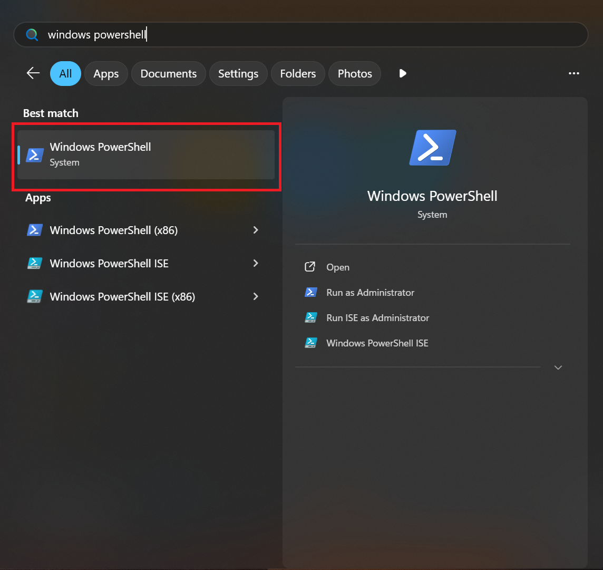
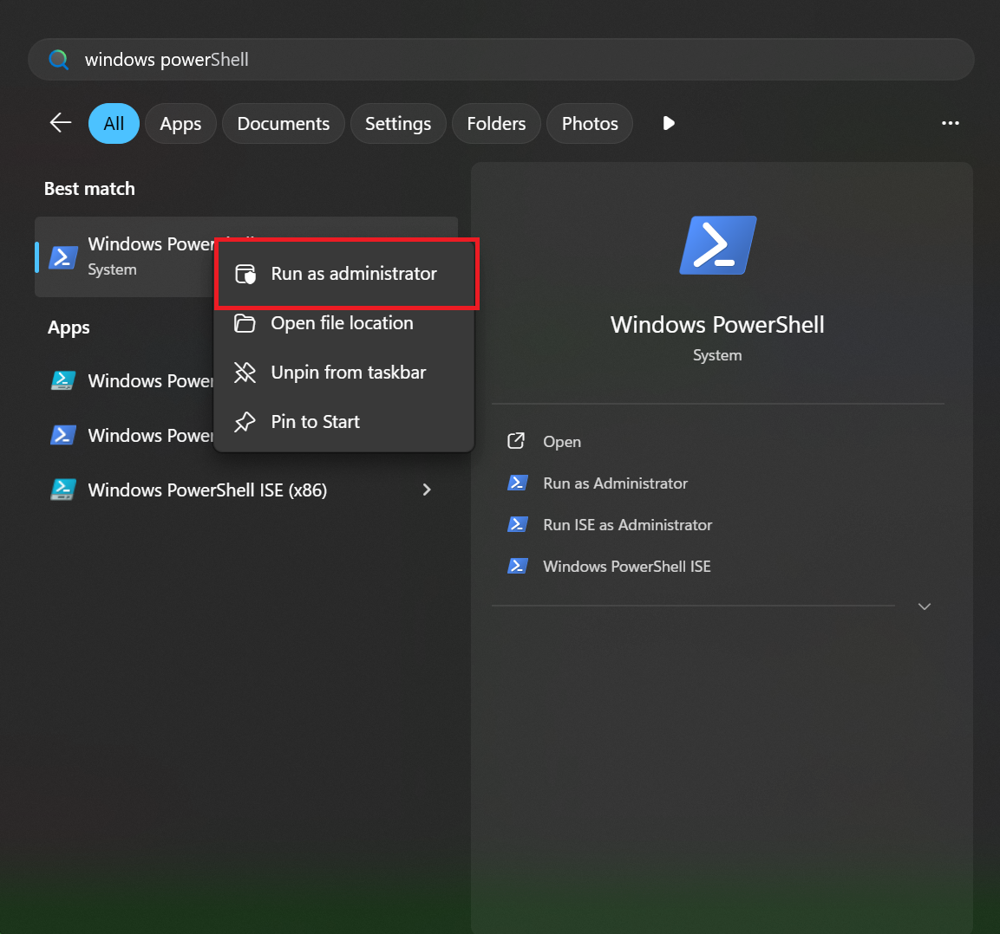
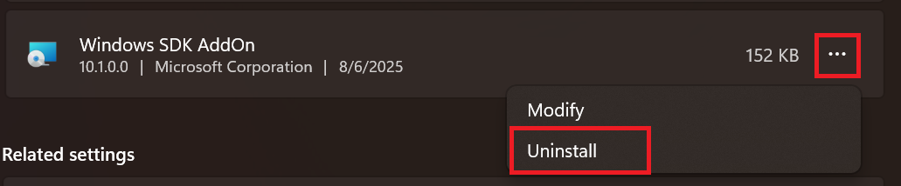

.. _preparing-the-environment-windows:

Preparing the environment (Windows)
===================================

This page describes the steps required for setting up the development
infrastructure on a Windows-based machine.

.. warning::

   This setup is currently **experimental** and was only tested using
   a machine running Windows 11 natively (i.e. no virtualization).

This guide assumes you're using ``PowerShell`` [#]_. Therefore, all of the
commands presented below are issued inside a ``PowerShell`` terminal.

Opening a PowerShell terminal
-----------------------------

To open a ``PowerShell`` terminal:

1. Open the **Start** menu by pressing on the ⊞ Win key.
2. Type in **windows powershell**.
3. Click on the highlighted area:

Prerequisites
-------------

Before proceeding, we'll assume that you already have ``winget`` installed
on your system [#]_.

.. note::

   If need be, you can substitute ``winget`` with another package manager
   like Chocolatey [#]_. In this case, you'll have to make sure that all
   of the required packages are installed before running the setup script.

You'll also need to install a couple of additional packages by running:

.. code-block:: powershell

   winget install --id Git.Git python

.. note::

   After installing python, please run ``python --version`` to make sure
   that the PATH was updated accordingly and that the installed python
   version is ``3.10`` or newer.

   If the command doesn't work, try closing the ``PowerShell`` terminal
   and opening a new one to force a reload of the PATH variable.

Finally, we need to create a work directory in which the setup script will
install the toolchain, clone the required repositories, etc. To do so, run [#]_:

.. code-block:: powershell

   New-Item -Path "~\Desktop\" -Name "nxpcup_root" -Type "Directory"
   cd ~\Desktop\nxpcup_root

.. warning::

   Make sure that the work directory path does not contain any whitespaces,
   otherwise the sample build step may fail. For instance, paths such as:
   ``C:\Users\TEST USER\Desktop\nxpcup_root\nxpcup`` should be avoided.

   As long as this constraint applies, you may place the work directory
   wherever you see fit. Additionally, you may choose to use a different
   name.

   You are not allowed to change the location of the work directory after
   running the setup script, otherwise your packages won't work properly.

.. _changing-ps-execution-policy:

Changing PowerShell's execution policy
~~~~~~~~~~~~~~~~~~~~~~~~~~~~~~~~~~~~~~

To protect users against running malicious code, PowerShell comes with
a mechanism which prevents users from running scripts that don't meet
certain conditions. For more details, you can read this `article`_.

Because of this protection mechanism, running the setup script might
not work, which is why, before proceeding, we need to make sure that
the policy is relaxed enough to allow us to execute our script.

To do so, you'll have to:

1. Open up a ``PowerShell`` terminal with administrator rights:

2. Run:

.. code-block:: powershell

   Set-ExecutionPolicy -ExecutionPolicy Unrestricted

.. note::

   This command sets the execution policy for the ``LocalMachine`` scope,
   which is why it requires admin rights.

   You can also choose to set the execution policy for the ``CurrentUser``
   scope, which will remove the need for admin rights.

.. note::

   After executing the command, PowerShell may ask you to acknowledge
   the change.

.. note::

   You can choose whatever execution policy you see fit as long as it's
   relaxed enough to allow the execution of the setup script.

To check if the policy was changed, you can run:

.. code-block:: powershell

   Get-ExecutionPolicy

which returns your effective execution policy.

.. warning::

   The execution policy has multiple scopes (e.g. LocalMachine,
   CurrentUser, etc.), some of which may take precedence over
   the LocalMachine scope. Therefore, if the policy was not
   changed after using ``Set-ExecutionPolicy``, you'll have to
   make sure that scopes with higher precedence are not
   currently using a more restrictive policy.

   For more details, you can read this `article`_.

Cloning the repository
----------------------

To clone the project repository:

.. code-block:: powershell

   git clone https://github.com/LaurentiuM1234/nxpcup.git
   cd nxpcup

.. warning::

   Please make sure you clone the project repository inside the work
   directory!

For information on the project structure, please see: :ref:`the-project-structure`.

Native development
------------------

The setup script
~~~~~~~~~~~~~~~~

The script used for setting up the environment for native development
can be found under ``scripts\setup.ps1``. The script has **three**
major functionalities:

1. Installing the additional packages required for building the application.
2. Downloading ``uuu``, which is the binary used to boot the board.
3. Setting up the ``west`` environment, which is required for building the
   application.

.. warning::

   If you're using a package manager that is not ``winget``, you'll have to
   install the required packages before running the setup script. You can
   find the list of required packages by opening the script and having a
   look at the ``packages`` variable.

.. note::

   Please make sure your current directory is ``~\Desktop\nxpcup_root\nxpcup``.

.. admonition:: For PowerShell 5.1 users
   :class: custom-note

   Powershell 5.1 creates an alias for the ``wget`` Linux command,
   defining it as ``Invoke-WebRequest``. Because of this, trying to invoke
   ``wget`` with the options you'd normally use on a Linux-based system will
   fail since those options are not recognized by ``Invoke-WebRequest``.

   The setup script needs ``wget`` to download the toolchain and, therefore,
   if the alias is not removed, it will not function properly.

   To remove the alias in the current terminal session, you can run:
   ``Remove-Item Alias:wget``. This change, however, will not be persistent.
   If you open a new terminal, you'll notice that the alias is still defined.

   To make the change persistent, run:``notepad $PROFILE`` and then add
   ``Remove-Item Alias:wget -ErrorAction SilentlyContinue`` to the file.
   Once you're done, close the current terminal and open a new one.

   To check if the alias is defined, run: ``Get-Alias wget``. If the alias
   is not defined, the command will fail.

To run the setup script:

.. code-block:: powershell

   Remove-Item Alias:wget # for PowerShell 5.1 users, see notes above
   .\scripts\setup.ps1

.. note::

   During the script's execution, you might be prompted to accept or deny
   the installation of certain packets.

.. note::

   The repository update and toolchain installation steps may take a while.

Looking at the structure of the work directory (i.e. ``nxpcup_root``), we can
see the following, newly created directories:

.. code-block:: text

   .
   ├── .west
   ├── modules
   ├── nxpcup
   ├── zephyr
   └── zephyr-sdk-0.17.2

Their meaning is described below:

* ``.west``: result of the west initialization step
* ``modules``: additional repositories
* ``zephyr``: source code of the Zephyr RTOS
* ``zephyr-sdk-0.17.2``: toolchain directory

Additionally, two new directories have been created under ``~\Desktop\nxpcup_root\nxpcup``:
``ENV`` and ``packages``. Their meaning is described below:

* ``ENV``: result of the virtual environment creation
* ``packages``: contains the packages installed during setup

Finally, the downloaded ``uuu`` binary will be placed under ``boot\uuu.exe``.

Uninstalling packages
~~~~~~~~~~~~~~~~~~~~~

.. warning::

   **DO NOT** manually delete the packages under ``packages`` otherwise
   you risk messing up your PATH variable. These will be automatically
   removed if you use one of the uninstall methods specified below.

Once you're permanently done with the development, you may want to delete
all of the previously installed packages. To do so, you can either:

.. code-block:: powershell

   winget uninstall --id <package_name>

or:

1. Go to ``Apps > Installed apps``.
2. Find the application you want to delete.
3. Click on ``...`` and then ``Uninstall``:

Building the ``hello_world`` sample
-----------------------------------

To check if the development environment was properly initialized, you can
build the ``hello_world`` sample application. Before doing so, however, you'll
have to activate the python virtual environment by running:

.. code-block:: powershell

   .\ENV\Scripts\Activate.ps1

.. note::

   The setup script also activates the python virtual environment,
   which is why you don't need to activate it after running the script.

.. warning::

   Please remember to activate the python virtual environment every time
   you open a new terminal session. This step needs to be performed before
   you build your application.

Now, build the ``hello_world`` application by running:

.. code-block:: powershell

   west build -p -b frdm_imx93//a55 samples\hello_world

Summary
~~~~~~~

Below you may find a summary of the steps required for initializing the
environment for native development: 

1. Create the work directory:

.. code-block:: powershell

   New-Item -Path "~\Desktop\" -Name "nxpcup_root" -Type "Directory"
   cd ~\Desktop\nxpcup_root

2. Clone the repository:

.. code-block:: powershell

   git clone https://github.com/LaurentiuM1234/nxpcup.git
   cd nxpcup

3. Remove alias for the ``wget`` command:

.. code-block:: powershell

   Remove-Item Alias:wget # for PowerShell 5.1 users, see notes above

4. Run the ``setup.ps1`` script:

.. code-block:: powershell

   .\scripts\setup.ps1

5. Activate the python virtual environment:

.. code-block:: powershell

   .\ENV\Scripts\Activate.ps1

6. Build the ``hello_world`` application:

.. code-block:: powershell

   west build -p -b frdm_imx93//a55 samples\hello_world

The ``west`` command
--------------------

For more details on the ``west`` command see :ref:`linux-west-command`.

.. [#] https://learn.microsoft.com/en-us/powershell/scripting/overview?view=powershell-7.5
.. [#] These packages should already be shipped with your OS.
.. [#] https://chocolatey.org/install
.. [#] Throughout this guide we'll assume that the work directory is called ``nxpcup_root`` and is placed in ``~\Desktop``.

.. _article: https://learn.microsoft.com/en-us/powershell/module/microsoft.powershell.core/about/about_execution_policies?view=powershell-7.5
